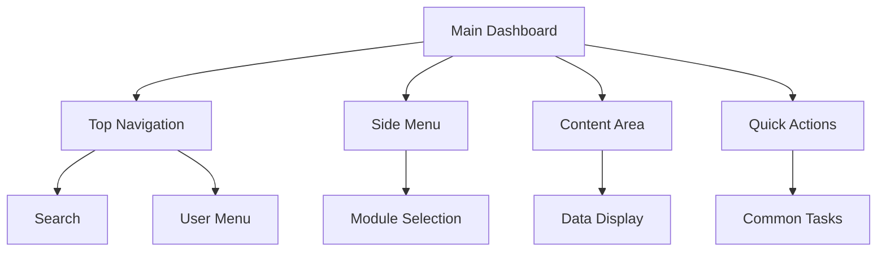
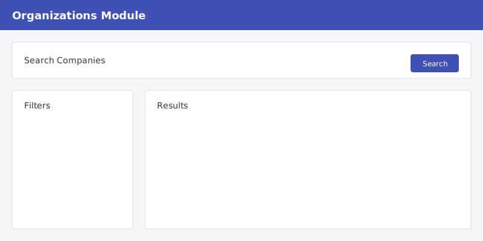
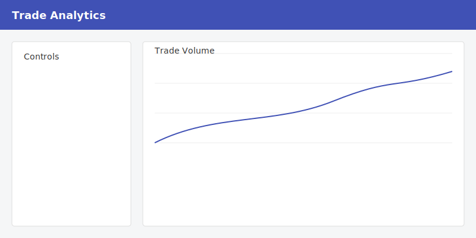
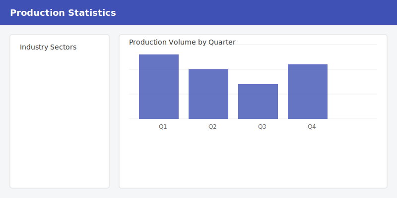
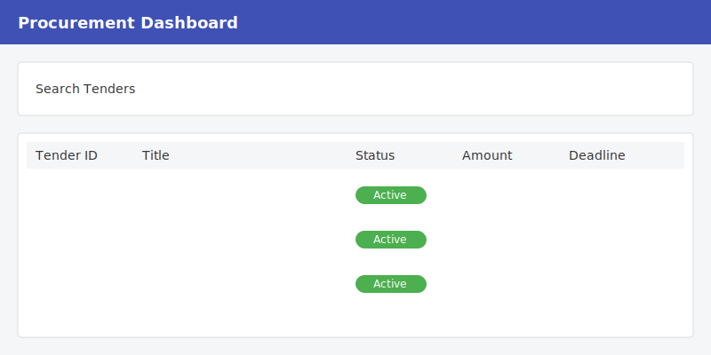
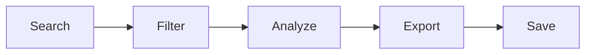

# Interface Overview

Learn how to navigate and use the KazDATA platform interface effectively.

## Main Interface Components

### :material-view-dashboard: Dashboard Layout

### :material-toolbar: Top Navigation Bar

- Global search
- Module switcher
- Notifications
- User profile
- Help center
- Quick actions

### :material-menu: Side Navigation

- Module selection
- Saved searches
- Recent activities
- Favorites
- Settings access

## Module Interfaces

### :material-office-building: Organizations Module

<figure markdown>
  
  <figcaption>Organizations Module Interface</figcaption>
</figure>

Key elements:
- Company search
- Advanced filters
- Results grid
- Detail view
- Export options

### :material-swap-horizontal: Trade Module

<figure markdown>
  
  <figcaption>Trade Analytics Interface</figcaption>
</figure>

Features:
- Trade data view
- Country selection
- Product categories
- Time period selector
- Analysis tools

### :material-factory: Production Module

<figure markdown>
  
  <figcaption>Production Statistics Interface</figcaption>
</figure>

Components:
- Industry sectors
- Production metrics
- Regional view
- Time series
- Data visualization

### :material-gavel: Procurement Module

<figure markdown>
  
  <figcaption>Procurement Dashboard Interface</figcaption>
</figure>

Elements:
- Tender search
- Contract data
- Price analysis
- Supplier info
- Status tracking

## Common Interface Elements

### :material-magnify: Search Interface

1. Global search bar
2. Advanced filters
3. Saved searches
4. Recent searches
5. Search suggestions

### :material-filter: Filters

- Quick filters
- Advanced filters
- Custom filters
- Filter combinations
- Filter templates

### :material-table: Data Grids

Features:
- Column sorting
- Custom views
- Data grouping
- Row selection
- Bulk actions

### :material-chart-box: Visualizations

Types:
- Line charts
- Bar graphs
- Pie charts
- Heat maps
- Geographic maps

## Interface Customization

### :material-cog: User Preferences

Customize your experience:

1. Theme selection
    - Light mode
    - Dark mode
    - System default
2. Layout options
    - Compact view
    - Comfortable view
    - Custom spacing
3. Display settings
    - Font size
    - Color scheme
    - Language

### :material-view-grid: Dashboard Customization

Arrange your dashboard:

- Widget placement
- Quick access tools
- Favorite reports
- Recent items
- Custom shortcuts

## Navigation Tips

### :material-keyboard: Keyboard Shortcuts

| Action | Windows/Linux | macOS |
|--------|--------------|-------|
| Global Search | Ctrl + K | ⌘ + K |
| Module Switch | Ctrl + M | ⌘ + M |
| Save | Ctrl + S | ⌘ + S |
| Export | Ctrl + E | ⌘ + E |
| Help | F1 | F1 |

### :material-gesture-tap: Quick Actions

Access common tasks:
- New search
- Export data
- Save view
- Share results
- Generate report

## Data Management

### :material-export: Export Options

1. Select data
2. Choose format
3. Configure options
4. Export file
5. Download results

### :material-content-save: Saving Work

- Save searches
- Save views
- Save reports
- Save templates
- Save preferences

## Best Practices

### :material-lightbulb: Efficiency Tips

1. Use keyboard shortcuts
2. Save common searches
3. Customize your dashboard
4. Create templates
5. Use quick filters

### :material-check-circle: Recommended Workflows

## Related Resources

- [Quick Start Guide](quick-start.md)
- [Data Export Guide](../data/export.md)
- [Best Practices](../data/best-practices.md)
- [FAQ](faq.md)

!!! tip "Interface Updates"
    The interface may be updated regularly with new features and improvements. Check the [Updates](../support/updates.md) page for the latest changes.
