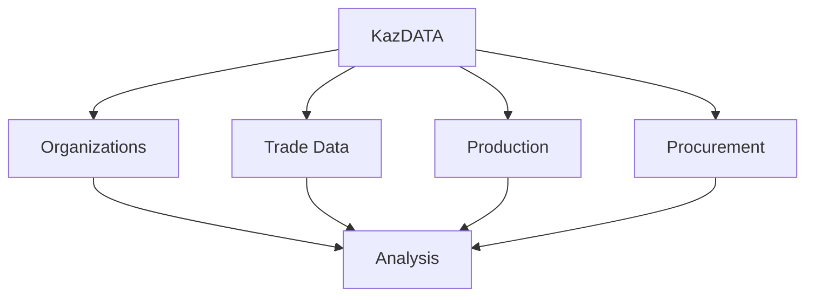

# Platform Overview

Welcome to KazDATA - your comprehensive business data platform for Kazakhstan.

## :material-view-dashboard: Platform Features

### Core Modules

### Key Features

| Module | Features | Use Cases |
|--------|----------|-----------|
| Organizations | Company data | Market research |
| Trade | Import/Export | Trade analysis |
| Production | Industry data | Sector analysis |
| Procurement | Tender data | Contract analysis |

## :material-database: Data Coverage

### Data Types

1. Company information
    - Registration data
    - Contact details
    - Financial info
    - Industry codes
    - Locations

2. Trade statistics
    - Import data
    - Export data
    - Country data
    - Product codes
    - Values

3. Production data
    - Industry sectors
    - Production volumes
    - Regional data
    - Time series
    - Trends

4. Procurement data
    - Tenders
    - Contracts
    - Suppliers
    - Prices
    - Analysis

## :material-tools: Platform Tools

### Analysis Tools

1. Search tools
    - Advanced search
    - Filters
    - Custom queries
    - Saved searches
    - Export options

2. Analysis features
    - Market analysis
    - Competition
    - Price tracking
    - Trends
    - Reports

### Data Access

- Web interface
- API access
- Data export
- Custom reports
- Integrations

## :material-account-group: User Access

### Access Levels

1. Basic access
    - Company search
    - Basic reports
    - Limited exports
    - Standard support

2. Professional access
    - Advanced search
    - Custom reports
    - Full exports
    - Priority support

3. Enterprise access
    - API access
    - Custom solutions
    - Dedicated support
    - Training

### User Management

- User roles
- Permissions
- Team sharing
- Usage tracking
- Analytics

## :material-rocket-launch: Getting Started

### Quick Start

1. Registration
    - Create account
    - Verify email
    - Complete profile
    - Choose plan

2. First steps
    - Platform tour
    - Basic search
    - Save results
    - Export data

### Learning Resources

- [Tutorials](../tutorials/index.md)
- [User Guide](../index.md)
- [API Docs](../api/index.md)
- [Support](../support/contact.md)

## :material-chart-timeline: Data Updates

### Update Schedule

| Data Type | Frequency | Source |
|-----------|-----------|---------|
| Companies | Daily | Official |
| Trade | Monthly | Customs |
| Production | Quarterly | Statistics |
| Procurement | Real-time | Government |

### Data Quality

- Official sources
- Regular updates
- Data validation
- Quality checks
- Error correction

## :material-security: Security

### Data Protection

1. Security measures
    - Encryption
    - Access control
    - Audit logs
    - Backups
    - Monitoring

2. Compliance
    - Data regulations
    - Privacy laws
    - Security standards
    - Best practices
    - Documentation

## Next Steps

1. [Register Account](registration.md)
2. [Choose Plan](subscription.md)
3. [Start Using](quick-start.md)

## Additional Resources

- [FAQ](faq.md)
- [Best Practices](../data/best-practices.md)
- [Use Cases](../use-cases/market-research.md)

!!! tip "Getting Help"
    Contact our [support team](../support/contact.md) for assistance with getting started.
