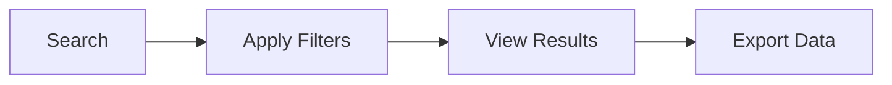
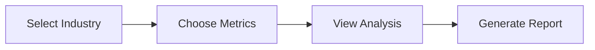
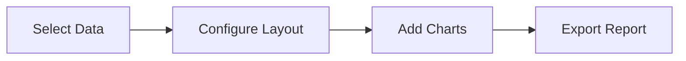

# Quick Start Guide

Get started with KazDATA in minutes. This guide will help you begin using the platform effectively.

## :material-numeric-1-circle: Sign Up

1. Visit [KazDATA Platform](https://kazdata.kz)
2. Click "Register" in the top right corner
3. Fill in your details:
    - Business email
    - Full name
    - Company name
    - Password
4. Verify your email address
5. Complete your profile

!!! tip "Professional Email"
    Use your business email for registration to ensure smooth verification and access to business features.

## :material-numeric-2-circle: Choose Your Plan

1. Review available [subscription plans](subscription.md)
2. Select the plan that fits your needs:
    - Basic: Essential company data
    - Professional: Advanced analytics
    - Enterprise: Full data access
3. Complete the payment process
4. Access is granted immediately

!!! info "Trial Access"
    New users get a 7-day trial of the Professional plan to explore all features.

## :material-numeric-3-circle: First Steps

### Access Company Data

1. Go to the Organizations module
2. Use the search bar to find companies
3. Apply filters:
    - Industry
    - Region
    - Company size
    - Status
4. View detailed company profiles

!!! example "Example Search"
    Search for "manufacturing companies in Almaty with 100+ employees"

### Analyze Trade Data

1. Navigate to Import/Export module
2. Select data type:
    - Imports
    - Exports
    - Both
3. Choose time period
4. View trade statistics

### Monitor Procurement

1. Open Procurement module
2. Browse active tenders
3. Analyze contract data
4. Track price trends

## :material-numeric-4-circle: Export Data

1. Select desired records
2. Click "Export" button
3. Choose format:
    - Excel
    - CSV
    - PDF
4. Configure export options
5. Download file

!!! tip "Batch Export"
    Use batch export for large datasets to save time.

## :material-numeric-5-circle: Save & Share

### Save Searches

1. Configure search parameters
2. Click "Save Search"
3. Name your search
4. Access saved searches anytime

### Create Reports

1. Select data views
2. Configure report layout
3. Add visualizations
4. Save or export report

## Common Tasks

### :material-magnify: Find Companies

### :material-chart-line: Analyze Markets

### :material-file-document: Generate Reports

## Keyboard Shortcuts

| Action | Windows/Linux | macOS |
|--------|--------------|-------|
| Search | Ctrl + K | ⌘ + K |
| Export | Ctrl + E | ⌘ + E |
| Save | Ctrl + S | ⌘ + S |
| Help | F1 | F1 |

## Next Steps

After completing these initial steps, explore:

- [Detailed Platform Overview](platform-overview.md)
- [Interface Guide](interface.md)
- [Analysis Tools](../analysis/market-size.md)
- [Use Cases](../use-cases/market-research.md)
- [Best Practices](../data/best-practices.md)

## Need Help?

- Check our [FAQ](faq.md)
- Visit [Support Center](../support/contact.md)
- Contact our team:
    - Email: support@kazdata.kz
    - Phone: +7 (XXX) XXX-XXXX
    - Live Chat: Available in platform

!!! success "Ready to Start?"
    You're now ready to begin using KazDATA! For more detailed information, explore our comprehensive documentation.
