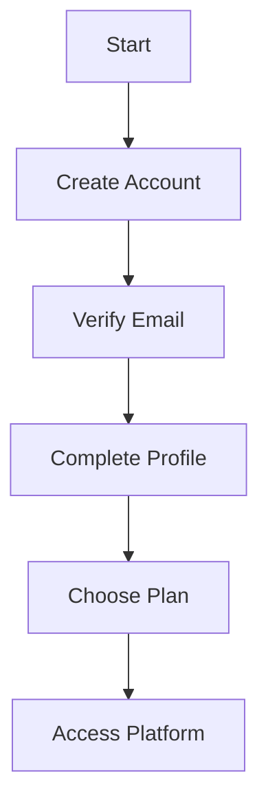

# Registration & Account

Learn how to register and set up your KazDATA account.

## :material-account-plus: Registration Process

### Steps to Register



### Required Information

| Field | Description | Example |
|-------|-------------|---------|
| Name | Full name | John Smith |
| Email | Business email | john@company.com |
| Company | Organization | Tech Solutions Ltd |
| Phone | Contact number | +7 777 123 4567 |
| Password | Secure password | ********** |

## :material-email: Email Verification

### Verification Process

1. Submit registration
    - Enter details
    - Accept terms
    - Create account
    - Receive email

2. Verify email
    - Open email
    - Click link
    - Confirm account
    - Access platform

### Troubleshooting

- Check spam folder
- Request new email
- Contact support
- Update email
- Verify domain

## :material-card-account-details: Profile Setup

### Profile Information

1. Basic details
    - Name
    - Title
    - Department
    - Location
    - Language

2. Company details
    - Company name
    - Industry
    - Size
    - Website
    - Address

### Profile Settings

```yaml
profile_settings:
  notifications:
    email: true
    platform: true
    reports: weekly
  preferences:
    language: en
    timezone: Asia/Almaty
    currency: KZT
```

## :material-shield-account: Account Security

### Security Features

1. Password requirements
    - Minimum length
    - Complexity
    - Expiration
    - History
    - Recovery

2. Two-factor authentication
    - Email verification
    - SMS codes
    - Authenticator app
    - Backup codes
    - Recovery options

### Security Settings

```python
def setup_security(account):
    security = SecurityManager()
    security.configure({
        'two_factor': True,
        'password_expiry': '90d',
        'login_attempts': 5,
        'session_timeout': '8h'
    })
```

## :material-package-variant: Subscription Setup

### Plan Selection

1. Available plans
    - Basic
    - Professional
    - Enterprise
    - Custom

2. Plan features
    - Data access
    - API calls
    - Export limits
    - Support level
    - Custom features

### Payment Options

- Credit card
- Bank transfer
- Invoice
- Annual billing
- Auto-renewal

## :material-cog: Account Settings

### General Settings

1. Account preferences
    - Language
    - Time zone
    - Currency
    - Date format
    - Number format

2. Notification settings
    - Email alerts
    - Platform notifications
    - Report delivery
    - System updates
    - Security alerts

### Team Management

```python
def manage_team(account):
    team = TeamManager()
    team.setup({
        'roles': ['admin', 'editor', 'viewer'],
        'permissions': {
            'data_access': True,
            'export': True,
            'share': True
        }
    })
```

## :material-school: Getting Started

### Initial Setup

1. Platform tour
    - Interface overview
    - Basic features
    - Quick search
    - Export data
    - Save results

2. Learning resources
    - [Tutorials](../tutorials/index.md)
    - [User Guide](../index.md)
    - [API Docs](../api/index.md)
    - [Support](../support/contact.md)

### First Steps

- Complete profile
- Configure settings
- Explore features
- Run test searches
- Save projects

## Next Steps

1. [Platform Overview](platform-overview.md)
2. [Quick Start Guide](quick-start.md)
3. [Interface Guide](interface.md)

## Additional Resources

- [FAQ](faq.md)
- [Best Practices](../data/best-practices.md)
- [Support](../support/contact.md)

!!! tip "Account Setup"
    Complete your profile and security settings before starting to use the platform.
