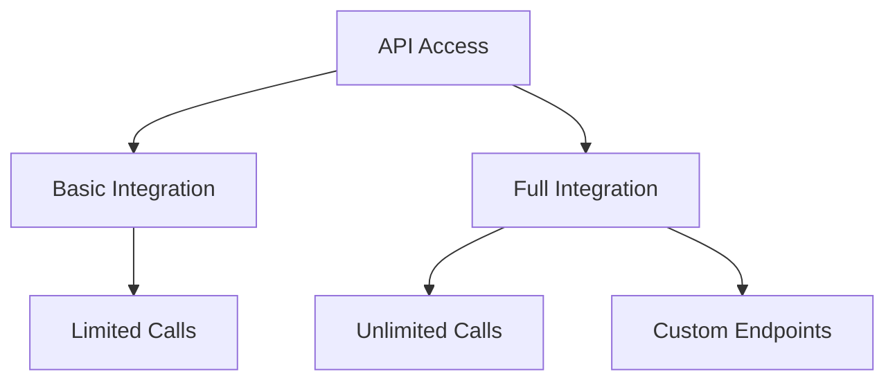
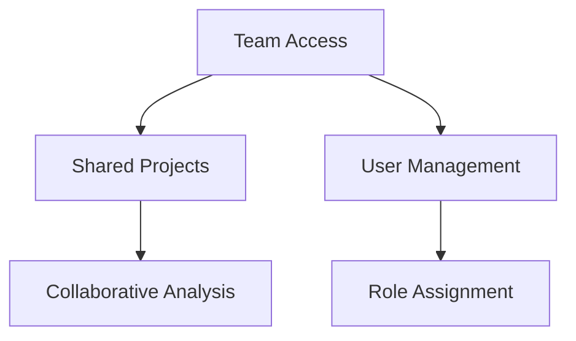

# Subscription Plans

Choose the right KazDATA subscription plan for your business needs.

## Plan Comparison

### :material-compare: Feature Overview

| Feature | Basic | Professional | Enterprise |
|---------|-------|--------------|------------|
| Company Data | ✓ | ✓ | ✓ |
| Search Filters | Basic | Advanced | Custom |
| Export Limit | 100/month | 1000/month | Unlimited |
| API Access | - | Limited | Full |
| Team Members | 1 | Up to 5 | Custom |
| Support | Email | Priority | Dedicated |
| Custom Features | - | - | ✓ |
| Price | Contact Sales | Contact Sales | Contact Sales |

## Plan Details

### :material-account: Basic Plan

Perfect for individual users and small businesses.

#### Features
- Basic company information
- Standard search capabilities
- Limited data export
- Email support
- Single user access

#### Best For
- Market research
- Basic company verification
- Individual use
- Small businesses
- Starting users

### :material-account-tie: Professional Plan

Ideal for growing businesses and teams.

#### Features
- Advanced company data
- Enhanced search filters
- Increased export limits
- Priority support
- Team collaboration
- Basic API access

#### Best For
- Business development
- Market analysis
- Sales teams
- Research departments
- Data integration

### :material-office-building: Enterprise Plan

Complete solution for large organizations.

#### Features
- Full data access
- Custom search options
- Unlimited exports
- Dedicated support
- Custom team size
- Full API access
- Custom features

#### Best For
- Large organizations
- Custom solutions
- System integration
- Multiple departments
- Advanced analytics

## Additional Services

### :material-api: API Access

### :material-account-group: Team Collaboration

## Payment Options

### :material-credit-card: Payment Methods

- Credit/Debit cards
- Bank transfer
- Electronic payments
- Corporate accounts
- Manual invoicing

### :material-calendar: Billing Cycles

- Monthly subscription
- Annual subscription (save 20%)
- Custom billing periods
- Enterprise agreements

## Special Offers

### :material-gift: Trial Access

!!! tip "Free Trial"
    Get 7 days of Professional plan access to explore all features.

### :material-percent: Discounts

- Annual subscription discount
- Non-profit organization discount
- Educational institution discount
- Startup program
- Volume licensing

## Enterprise Solutions

### :material-cog: Custom Features

- Custom data integration
- Specialized reports
- Dedicated infrastructure
- Custom API endpoints
- Enhanced security

### :material-shield: Enterprise Support

- Dedicated account manager
- 24/7 priority support
- Custom training
- Technical consultation
- Implementation assistance

## Subscription Management

### :material-cog: Managing Your Plan

1. Access subscription settings
2. View current plan
3. Change subscription
4. Update billing
5. View usage statistics

### :material-history: Usage Monitoring

- Track data exports
- Monitor API calls
- View team activity
- Check search history
- Analyze usage patterns

## Support & Resources

### :material-help: Getting Help

- [Contact Support](../support/contact.md)
- [FAQ](faq.md)
- [Documentation](../index.md)
- Sales consultation
- Technical support

### :material-school: Training Resources

- Platform tutorials
- Best practices guides
- API documentation
- Use case examples
- Video training

## Next Steps

1. [Register Account](registration.md)
2. Choose your plan
3. [Start Quick Tutorial](quick-start.md)
4. [Explore Features](platform-overview.md)

!!! info "Need Help Choosing?"
    Contact our sales team for a personalized consultation and plan recommendation.
