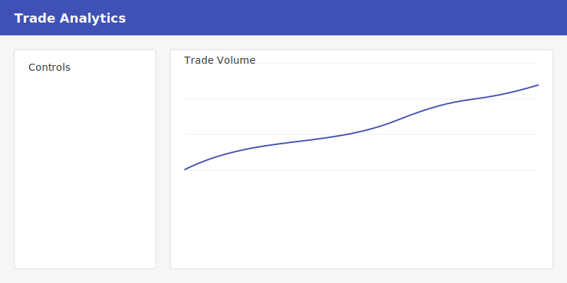
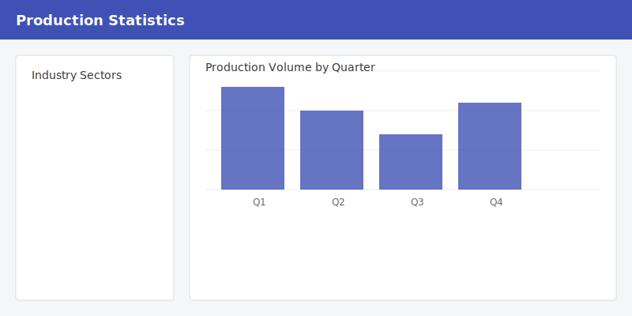
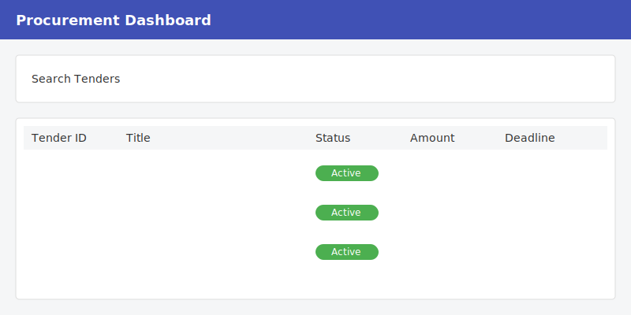

# Обзор интерфейса

Узнайте, как эффективно навигировать и использовать интерфейс платформы KazDATA.

## Основные компоненты интерфейса

### :material-view-dashboard: Макет панели управления

### :material-toolbar: Верхняя навигационная панель

- Глобальный поиск
- Переключатель модулей
- Уведомления
- Профиль пользователя
- Центр помощи
- Быстрые действия

### :material-menu: Боковая навигация

- Выбор модуля
- Сохраненные поиски
- Последние действия
- Избранное
- Доступ к настройкам

## Интерфейсы модулей

### :material-office-building: Модуль организаций

<figure markdown>
  
  <figcaption>Интерфейс модуля организаций</figcaption>
</figure>

Ключевые элементы:
- Поиск компаний
- Расширенные фильтры
- Сетка результатов
- Просмотр деталей
- Варианты экспорта

### :material-swap-horizontal: Модуль торговли

<figure markdown>
  
  <figcaption>Интерфейс аналитики торговли</figcaption>
</figure>

Функции:
- Просмотр торговых данных
- Выбор страны
- Категории продуктов
- Выбор временного периода
- Инструменты анализа

### :material-factory: Модуль производства

<figure markdown>
  
  <figcaption>Интерфейс статистики производства</figcaption>
</figure>

Компоненты:
- Отраслевые сектора
- Метрики производства
- Региональный обзор
- Временные ряды
- Визуализация данных

### :material-gavel: Модуль закупок

<figure markdown>
  
  <figcaption>Интерфейс панели управления закупками</figcaption>
</figure>

Элементы:
- Поиск тендеров
- Данные о контрактах
- Анализ цен
- Информация о поставщиках
- Отслеживание статуса

## Общие элементы интерфейса

### :material-magnify: Интерфейс поиска

1. Глобальная строка поиска
2. Расширенные фильтры
3. Сохраненные поиски
4. Последние поиски
5. Предложения по поиску

### :material-filter: Фильтры

- Быстрые фильтры
- Расширенные фильтры
- Пользовательские фильтры
- Комбинации фильтров
- Шаблоны фильтров

### :material-table: Таблицы данных

Функции:
- Сортировка по столбцам
- Пользовательские представления
- Группировка данных
- Выбор строк
- Массовые действия

### :material-chart-box: Визуализации

Типы:
- Линейные графики
- Столбчатые диаграммы
- Круговые диаграммы
- Тепловые карты
- Географические карты

## Настройка интерфейса

### :material-cog: Предпочтения пользователя

Настройте свой опыт:

1. Выбор темы
    - Светлый режим
    - Темный режим
    - Системный по умолчанию
2. Опции макета
    - Компактный вид
    - Удобный вид
    - Пользовательские отступы
3. Настройки отображения
    - Размер шрифта
    - Цветовая схема
    - Язык

### :material-view-grid: Настройка панели управления

Организуйте свою панель управления:

- Размещение виджетов
- Быстрые инструменты доступа
- Избранные отчеты
- Последние элементы
- Пользовательские ярлыки

## Советы по навигации

### :material-keyboard: Горячие клавиши

| Действие | Windows/Linux | macOS |
|----------|---------------|-------|
| Глобальный поиск | Ctrl + K | ⌘ + K |
| Переключение модуля | Ctrl + M | ⌘ + M |
| Сохранить | Ctrl + S | ⌘ + S |
| Экспорт | Ctrl + E | ⌘ + E |
| Помощь | F1 | F1 |

### :material-gesture-tap: Быстрые действия

Доступ к общим задачам:
- Новый поиск
- Экспорт данных
- Сохранить вид
- Поделиться результатами
- Сгенерировать отчет

## Управление данными

### :material-export: Варианты экспорта

1. Выберите данные
2. Выберите формат
3. Настройте параметры
4. Экспортируйте файл
5. Скачайте результаты

### :material-content-save: Сохранение работы

- Сохранить поиски
- Сохранить виды
- Сохранить отчеты
- Сохранить шаблоны
- Сохранить предпочтения

## Лучшие практики

### :material-lightbulb: Советы по эффективности

1. Используйте горячие клавиши
2. Сохраняйте общие поиски
3. Настройте свою панель управления
4. Создавайте шаблоны
5. Используйте быстрые фильтры

### :material-check-circle: Рекомендуемые рабочие процессы

## Связанные ресурсы

- [Руководство по быстрому старту](quick-start.md)
- [Руководство по экспорту данных](../data/export.md)
- [Лучшие практики](../data/best-practices.md)
- [Часто задаваемые вопросы](faq.md)

!!! tip "Обновления интерфейса"
    Интерфейс может регулярно обновляться с новыми функциями и улучшениями. Проверьте страницу [Обновления](../support/updates.md) для получения последних изменений.
