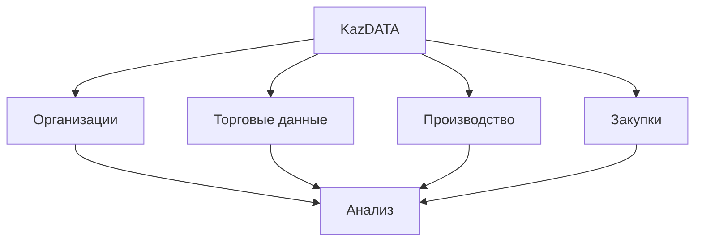

# Обзор платформы

Добро пожаловать в KazDATA - вашу комплексную платформу бизнес-данных для Казахстана.

## :material-view-dashboard: Функции платформы

### Основные модули

### Ключевые функции

| Модуль | Функции | Сценарии использования |
|--------|---------|-----------------------|
| Организации | Данные о компаниях | Исследование рынка |
| Торговля | Импорт/Экспорт | Анализ торговли |
| Производство | Данные по отраслям | Анализ сектора |
| Закупки | Данные о тендерах | Анализ контрактов |

## :material-database: Охват данных

### Типы данных

1. Информация о компаниях
    - Данные о регистрации
    - Контактные данные
    - Финансовая информация
    - Отраслевые коды
    - Местоположения

2. Торговая статистика
    - Данные о импорте
    - Данные о экспорте
    - Данные по странам
    - Коды продуктов
    - Значения

3. Данные о производстве
    - Отраслевые сектора
    - Объемы производства
    - Региональные данные
    - Временные ряды
    - Тенденции

4. Данные о закупках
    - Тендеры
    - Контракты
    - Поставщики
    - Цены
    - Анализ

## :material-tools: Инструменты платформы

### Инструменты анализа

1. Инструменты поиска
    - Расширенный поиск
    - Фильтры
    - Пользовательские запросы
    - Сохраненные поиски
    - Варианты экспорта

2. Функции анализа
    - Анализ рынка
    - Конкуренция
    - Отслеживание цен
    - Тенденции
    - Отчеты

### Доступ к данным

- Веб-интерфейс
- Доступ к API
- Экспорт данных
- Пользовательские отчеты
- Интеграции

## :material-account-group: Доступ пользователей

### Уровни доступа

1. Базовый доступ
    - Поиск компаний
    - Базовые отчеты
    - Ограниченный экспорт
    - Стандартная поддержка

2. Профессиональный доступ
    - Расширенный поиск
    - Пользовательские отчеты
    - Полный экспорт
    - Приоритетная поддержка

3. Корпоративный доступ
    - Доступ к API
    - Пользовательские решения
    - Выделенная поддержка
    - Обучение

### Управление пользователями

- Роли пользователей
- Разрешения
- Совместное использование команды
- Отслеживание использования
- Аналитика

## :material-rocket-launch: Начало работы

### Быстрый старт

1. Регистрация
    - Создайте учетную запись
    - Подтвердите электронную почту
    - Завершите профиль
    - Выберите план

2. Первые шаги
    - Обзор платформы
    - Базовый поиск
    - Сохранение результатов
    - Экспорт данных

### Учебные ресурсы

- [Учебники](../tutorials/index.md)
- [Руководство пользователя](../index.md)
- [Документация API](../api/index.md)
- [Поддержка](../support/contact.md)

## :material-chart-timeline: Обновления данных

### График обновлений

| Тип данных | Частота | Источник |
|------------|---------|----------|
| Компании | Ежедневно | Официальный |
| Торговля | Ежемесячно | Таможня |
| Производство | Квартально | Статистика |
| Закупки | В реальном времени | Государство |

### Качество данных

- Официальные источники
- Регулярные обновления
- Валидация данных
- Проверка качества
- Исправление ошибок

## :material-security: Безопасность

### Защита данных

1. Меры безопасности
    - Шифрование
    - Контроль доступа
    - Журналы аудита
    - Резервные копии
    - Мониторинг

2. Соответствие
    - Регулирование данных
    - Законы о конфиденциальности
    - Стандарты безопасности
    - Лучшие практики
    - Документация

## Следующие шаги

1. [Зарегистрируйте учетную запись](registration.md)
2. [Выберите план](subscription.md)
3. [Начните использовать](quick-start.md)

## Дополнительные ресурсы

- [Часто задаваемые вопросы](faq.md)
- [Лучшие практики](../data/best-practices.md)
- [Сценарии использования](../use-cases/market-research.md)

!!! tip "Получение помощи"
    Свяжитесь с нашей [командой поддержки](../support/contact.md) для получения помощи в начале работы.
