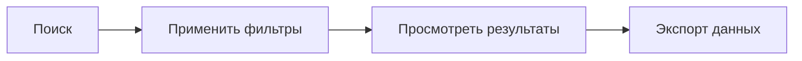
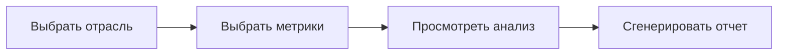
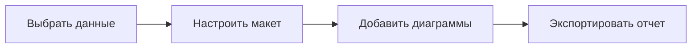

# Руководство по быстрому старту

Начните работу с KazDATA за считанные минуты. Это руководство поможет вам эффективно начать использование платформы.

## :material-numeric-1-circle: Регистрация

1. Перейдите на [Платформу KazDATA](https://kazdata.kz)
2. Нажмите "Регистрация" в правом верхнем углу
3. Заполните свои данные:
    - Деловая электронная почта
    - Полное имя
    - Название компании
    - Пароль
4. Подтвердите адрес электронной почты
5. Завершите свой профиль

!!! tip "Деловая электронная почта"
    Используйте свою деловую электронную почту для регистрации, чтобы обеспечить плавную проверку и доступ к бизнес-функциям.

## :material-numeric-2-circle: Выберите свой план

1. Ознакомьтесь с доступными [планами подписки](subscription.md)
2. Выберите план, который соответствует вашим потребностям:
    - Базовый: Основные данные о компании
    - Профессиональный: Расширенная аналитика
    - Корпоративный: Полный доступ к данным
3. Завершите процесс оплаты
4. Доступ предоставляется немедленно

!!! info "Пробный доступ"
    Новые пользователи получают 7-дневный пробный период Профессионального плана для изучения всех функций.

## :material-numeric-3-circle: Первые шаги

### Доступ к данным о компаниях

1. Перейдите в модуль Организаций
2. Используйте строку поиска для нахождения компаний
3. Примените фильтры:
    - Отрасль
    - Регион
    - Размер компании
    - Статус
4. Просмотрите детализированные профили компаний

!!! example "Пример поиска"
    Поиск "производственные компании в Алматы с более чем 100 сотрудниками"

### Анализ торговых данных

1. Перейдите в модуль Импорт/Экспорт
2. Выберите тип данных:
    - Импорт
    - Экспорт
    - Оба
3. Выберите временной период
4. Просмотрите торговую статистику

### Мониторинг закупок

1. Откройте модуль Закупок
2. Просмотрите активные тендеры
3. Проанализируйте данные о контрактах
4. Отслеживайте ценовые тенденции

## :material-numeric-4-circle: Экспорт данных

1. Выберите нужные записи
2. Нажмите кнопку "Экспорт"
3. Выберите формат:
    - Excel
    - CSV
    - PDF
4. Настройте параметры экспорта
5. Скачайте файл

!!! tip "Пакетный экспорт"
    Используйте пакетный экспорт для больших наборов данных, чтобы сэкономить время.

## :material-numeric-5-circle: Сохранение и обмен

### Сохранение поисков

1. Настройте параметры поиска
2. Нажмите "Сохранить поиск"
3. Назовите свой поиск
4. Получите доступ к сохраненным поискам в любое время

### Создание отчетов

1. Выберите представления данных
2. Настройте макет отчета
3. Добавьте визуализации
4. Сохраните или экспортируйте отчет

## Общие задачи

### :material-magnify: Поиск компаний

### :material-chart-line: Анализ рынков

### :material-file-document: Генерация отчетов

## Горячие клавиши

| Действие | Windows/Linux | macOS |
|----------|---------------|-------|
| Поиск | Ctrl + K | ⌘ + K |
| Экспорт | Ctrl + E | ⌘ + E |
| Сохранить | Ctrl + S | ⌘ + S |
| Помощь | F1 | F1 |

## Следующие шаги

После завершения этих начальных шагов изучите:

- [Подробный обзор платформы](platform-overview.md)
- [Руководство по интерфейсу](interface.md)
- [Инструменты анализа](../analysis/market-size.md)
- [Сценарии использования](../use-cases/market-research.md)
- [Лучшие практики](../data/best-practices.md)

## Нужна помощь?

- Ознакомьтесь с нашим [FAQ](faq.md)
- Посетите [Центр поддержки](../support/contact.md)
- Свяжитесь с нашей командой:
    - Электронная почта: support@kazdata.kz
    - Телефон: +7 (XXX) XXX-XXXX
    - Живой чат: Доступен на платформе

!!! success "Готовы начать?"
    Теперь вы готовы начать использовать KazDATA! Для получения более подробной информации изучите нашу обширную документацию.
