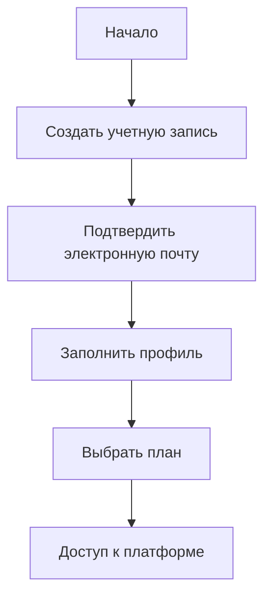

# Регистрация и учетная запись

Узнайте, как зарегистрироваться и настроить свою учетную запись KazDATA.

## :material-account-plus: Процесс регистрации

### Шаги для регистрации



### Необходимая информация

| Поле | Описание | Пример |
|------|----------|--------|
| Имя | Полное имя | Джон Смит |
| Электронная почта | Деловая электронная почта | john@company.com |
| Компания | Организация | Tech Solutions Ltd |
| Телефон | Контактный номер | +7 777 123 4567 |
| Пароль | Безопасный пароль | ********** |

## :material-email: Подтверждение электронной почты

### Процесс подтверждения

1. Отправить регистрацию
    - Ввести данные
    - Принять условия
    - Создать учетную запись
    - Получить электронное письмо

2. Подтвердить электронную почту
    - Открыть электронное письмо
    - Нажать на ссылку
    - Подтвердить учетную запись
    - Получить доступ к платформе

### Устранение неполадок

- Проверьте папку спама
- Запросите новое письмо
- Свяжитесь с поддержкой
- Обновите электронную почту
- Подтвердите домен

## :material-card-account-details: Настройка профиля

### Информация о профиле

1. Основные данные
    - Имя
    - Должность
    - Отдел
    - Местоположение
    - Язык

2. Данные о компании
    - Название компании
    - Отрасль
    - Размер
    - Веб-сайт
    - Адрес

### Настройки профиля

```yaml
profile_settings:
  notifications:
    email: true
    platform: true
    reports: weekly
  preferences:
    language: en
    timezone: Asia/Almaty
    currency: KZT
```

## :material-shield-account: Безопасность учетной записи

### Функции безопасности

1. Требования к паролю
    - Минимальная длина
    - Сложность
    - Истечение срока действия
    - История
    - Восстановление

2. Двухфакторная аутентификация
    - Подтверждение по электронной почте
    - SMS-коды
    - Приложение аутентификатора
    - Резервные коды
    - Варианты восстановления

### Настройки безопасности

```python
def setup_security(account):
    security = SecurityManager()
    security.configure({
        'two_factor': True,
        'password_expiry': '90d',
        'login_attempts': 5,
        'session_timeout': '8h'
    })
```

## :material-package-variant: Настройка подписки

### Выбор плана

1. Доступные планы
    - Базовый
    - Профессиональный
    - Корпоративный
    - Индивидуальный

2. Функции плана
    - Доступ к данным
    - Вызовы API
    - Ограничения на экспорт
    - Уровень поддержки
    - Индивидуальные функции

### Варианты оплаты

- Кредитная карта
- Банковский перевод
- Счет
- Годовая подписка
- Автоматическое продление

## :material-cog: Настройки учетной записи

### Общие настройки

1. Предпочтения учетной записи
    - Язык
    - Часовой пояс
    - Валюта
    - Формат даты
    - Формат числа

2. Настройки уведомлений
    - Уведомления по электронной почте
    - Уведомления на платформе
    - Доставка отчетов
    - Обновления системы
    - Уведомления о безопасности

### Управление командой

```python
def manage_team(account):
    team = TeamManager()
    team.setup({
        'roles': ['admin', 'editor', 'viewer'],
        'permissions': {
            'data_access': True,
            'export': True,
            'share': True
        }
    })
```

## :material-school: Начало работы

### Первоначальная настройка

1. Обзор платформы
    - Обзор интерфейса
    - Основные функции
    - Быстрый поиск
    - Экспорт данных
    - Сохранение результатов

2. Учебные ресурсы
    - [Учебники](../tutorials/index.md)
    - [Руководство пользователя](../index.md)
    - [Документация API](../api/index.md)
    - [Поддержка](../support/contact.md)

### Первые шаги

- Завершите профиль
- Настройте параметры
- Изучите функции
- Выполните тестовые поиски
- Сохраните проекты

## Следующие шаги

1. [Обзор платформы](platform-overview.md)
2. [Руководство по быстрому старту](quick-start.md)
3. [Руководство по интерфейсу](interface.md)

## Дополнительные ресурсы

- [Часто задаваемые вопросы](faq.md)
- [Лучшие практики](../data/best-practices.md)
- [Поддержка](../support/contact.md)

!!! tip "Настройка учетной записи"
    Завершите настройку профиля и параметры безопасности перед началом использования платформы.
