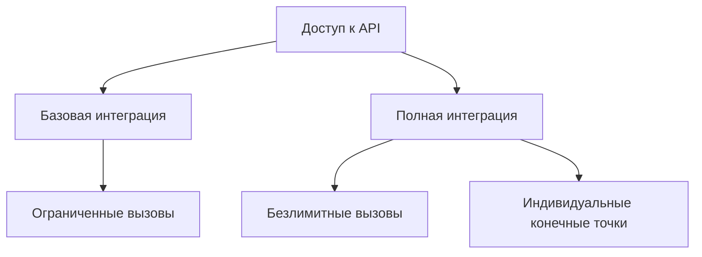
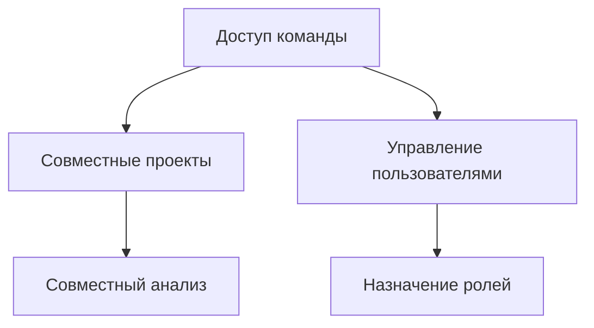

# Планы подписки

Выберите подходящий план подписки KazDATA для ваших бизнес-потребностей.

## Сравнение планов

### :material-compare: Обзор функций

| Функция | Базовый | Профессиональный | Корпоративный |
|----------|---------|------------------|---------------|
| Данные о компании | ✓ | ✓ | ✓ |
| Поисковые фильтры | Базовые | Расширенные | Индивидуальные |
| Ограничение на экспорт | 100/месяц | 1000/месяц | Без ограничений |
| Доступ к API | - | Ограниченный | Полный |
| Члены команды | 1 | До 5 | Индивидуально |
| Поддержка | Электронная почта | Приоритетная | Выделенная |
| Индивидуальные функции | - | - | ✓ |
| Цена | Связаться с отделом продаж | Связаться с отделом продаж | Связаться с отделом продаж |

## Подробности плана

### :material-account: Базовый план

Идеально подходит для индивидуальных пользователей и малых предприятий.

#### Функции
- Основная информация о компании
- Стандартные возможности поиска
- Ограниченный экспорт данных
- Поддержка по электронной почте
- Доступ для одного пользователя

#### Лучше всего подходит для
- Исследования рынка
- Базовой проверки компаний
- Индивидуального использования
- Малых предприятий
- Начинающих пользователей

### :material-account-tie: Профессиональный план

Идеален для растущих бизнесов и команд.

#### Функции
- Расширенные данные о компаниях
- Улучшенные поисковые фильтры
- Увеличенные лимиты на экспорт
- Приоритетная поддержка
- Командное сотрудничество
- Базовый доступ к API

#### Лучше всего подходит для
- Развития бизнеса
- Анализа рынка
- Команд продаж
- Исследовательских отделов
- Интеграции данных

### :material-office-building: Корпоративный план

Полное решение для крупных организаций.

#### Функции
- Полный доступ к данным
- Индивидуальные параметры поиска
- Безлимитный экспорт
- Выделенная поддержка
- Индивидуальный размер команды
- Полный доступ к API
- Индивидуальные функции

#### Лучше всего подходит для
- Крупных организаций
- Индивидуальных решений
- Интеграции систем
- Нескольких отделов
- Расширенной аналитики

## Дополнительные услуги

### :material-api: Доступ к API

### :material-account-group: Командное сотрудничество

## Варианты оплаты

### :material-credit-card: Методы оплаты

- Кредитные/дебетовые карты
- Банковский перевод
- Электронные платежи
- Корпоративные счета
- Ручное выставление счетов

### :material-calendar: Циклы выставления счетов

- Ежемесячная подписка
- Годовая подписка (экономия 20%)
- Индивидуальные циклы выставления счетов
- Корпоративные соглашения

## Специальные предложения

### :material-gift: Пробный доступ

!!! tip "Бесплатный пробный период"
    Получите 7 дней доступа к Профессиональному плану, чтобы изучить все функции.

### :material-percent: Скидки

- Скидка на годовую подписку
- Скидка для некоммерческих организаций
- Скидка для образовательных учреждений
- Программа для стартапов
- Лицензирование по объему

## Корпоративные решения

### :material-cog: Индивидуальные функции

- Индивидуальная интеграция данных
- Специализированные отчеты
- Выделенная инфраструктура
- Индивидуальные конечные точки API
- Повышенная безопасность

### :material-shield: Корпоративная поддержка

- Выделенный менеджер по аккаунту
- Приоритетная поддержка 24/7
- Индивидуальное обучение
- Технические консультации
- Помощь в реализации

## Управление подпиской

### :material-cog: Управление вашим планом

1. Доступ к настройкам подписки
2. Просмотр текущего плана
3. Изменение подписки
4. Обновление выставления счетов
5. Просмотр статистики использования

### :material-history: Мониторинг использования

- Отслеживание экспортов данных
- Мониторинг вызовов API
- Просмотр активности команды
- Проверка истории поиска
- Анализ паттернов использования

## Поддержка и ресурсы

### :material-help: Получение помощи

- [Связаться с поддержкой](../support/contact.md)
- [Часто задаваемые вопросы](faq.md)
- [Документация](../index.md)
- Консультация по продажам
- Техническая поддержка

### :material-school: Учебные ресурсы

- Учебники по платформе
- Руководства по лучшим практикам
- Документация API
- Примеры сценариев использования
- Видеоуроки

## Следующие шаги

1. [Зарегистрируйте учетную запись](registration.md)
2. Выберите свой план
3. [Начните быстрый учебник](quick-start.md)
4. [Изучите функции](platform-overview.md)

!!! info "Нужна помощь с выбором?"
    Свяжитесь с нашей командой продаж для получения персонализированной консультации и рекомендации по плану.
