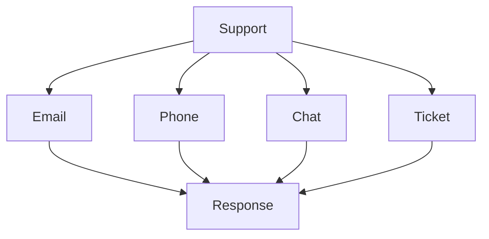

# Contact Support

Get help and support for KazDATA platform.

## :material-help-circle: Support Options

### Contact Methods



### Support Channels

| Channel | Response Time | Hours |
|---------|--------------|-------|
| Email | 24 hours | 24/7 |
| Phone | Immediate | 9-18 |
| Chat | < 5 min | 24/7 |
| Ticket | 48 hours | 24/7 |

## :material-email: Email Support

### Email Process

1. Send email
    - support@kazdata.kz
    - Include account
    - Describe issue
    - Add screenshots

2. Get response
    - Ticket number
    - Initial reply
    - Solution steps
    - Follow-up

### Email Guidelines

- Clear subject
- Detailed description
- Account details
- Screenshots
- Error messages

## :material-phone: Phone Support

### Phone Hours

1. Business hours
    - Monday-Friday
    - 9:00-18:00
    - Almaty time
    - Holidays excluded

2. Emergency support
    - 24/7 availability
    - Critical issues
    - System outages
    - Security incidents

### Contact Numbers

- General: +7 727 123 4567
- Technical: +7 727 123 4568
- Emergency: +7 727 123 4569
- International: +1 234 567 8900

## :material-chat: Live Chat

### Chat Support

1. Chat features
    - Real-time help
    - File sharing
    - Screen sharing
    - Chat history
    - Transcripts

2. Chat availability
    - 24/7 support
    - Multiple languages
    - Queue system
    - Priority support

### Chat Guidelines

```yaml
chat_guidelines:
  preparation:
    - Account ready
    - Issue details
    - Screenshots
    - Error messages
  etiquette:
    - Clear communication
    - Patient waiting
    - Respectful interaction
    - Follow instructions
```

## :material-ticket: Support Tickets

### Ticket System

1. Create ticket
    - Portal login
    - Issue category
    - Description
    - Priority level
    - Attachments

2. Track progress
    - Status updates
    - Comments
    - Resolution
    - Feedback
    - History

### Priority Levels

| Level | Response | Description |
|-------|----------|-------------|
| P1 | 1 hour | System down |
| P2 | 4 hours | Major issue |
| P3 | 24 hours | Minor issue |
| P4 | 48 hours | Question |

## :material-school: Learning Resources

### Documentation

1. User guides
    - [User Guide](../index.md)
    - [Tutorials](../tutorials/index.md)
    - [API Documentation](../api/index.md)
    - [Best Practices](../data/best-practices.md)

2. Training materials
    - Video tutorials
    - Webinars
    - Workshops
    - Case studies

### Self-Help

- Knowledge base
- FAQ section
- Community forum
- Video library
- Code samples

## :material-frequently-asked-questions: Common Issues

### Quick Solutions

1. Access issues
    - Password reset
    - Account unlock
    - Permission fix
    - Session clear

2. Data issues
    - Cache clear
    - Data refresh
    - Export retry
    - Format fix

### Troubleshooting

- Error codes
- Common problems
- Quick fixes
- Workarounds
- Prevention

## Next Steps

1. [Troubleshooting Guide](troubleshooting.md)
2. [Common Issues](issues.md)
3. [System Updates](updates.md)

## Additional Resources

- [FAQ](../getting-started/faq.md)
- [Best Practices](../data/best-practices.md)
- [Platform Overview](../getting-started/platform-overview.md)

!!! tip "Quick Response"
    Include your account details and clear issue description for faster support.
