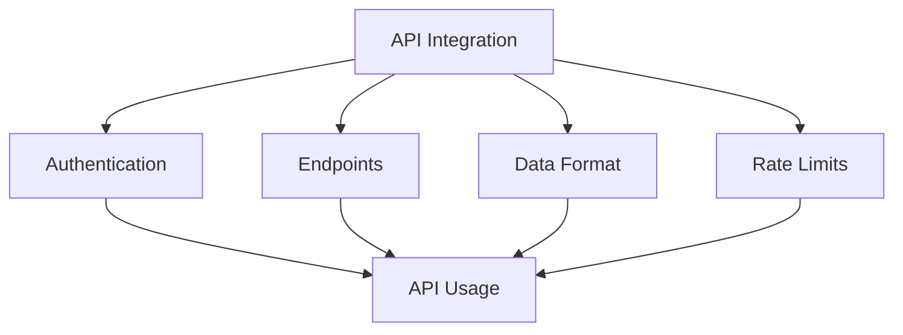

# API Integration

Learn how to integrate KazDATA's API into your applications.

## :material-api: API Basics

### Overview



### Key Concepts

| Concept | Description | Example |
|---------|-------------|---------|
| Endpoints | API URLs | /v1/companies |
| Methods | HTTP verbs | GET, POST |
| Parameters | Request data | ?limit=10 |
| Headers | Request metadata | Authorization |
| Response | Return data | JSON object |

## :material-key: Authentication

### API Keys

1. Get API key
    - Register account
    - Choose plan
    - Generate key
    - Manage keys

2. Key usage
    - Bearer token
    - Header inclusion
    - Key rotation
    - Security best practices

### OAuth Flow

1. Authorization
    - Client registration
    - Scope definition
    - Token request
    - Token refresh

2. Implementation
    - Authorization code
    - Client credentials
    - Refresh tokens
    - Token management

## :material-code-array: Endpoints

### Core Endpoints

1. Organizations
```http
GET /v1/organizations
POST /v1/organizations/search
GET /v1/organizations/{id}
```

2. Trade Data
```http
GET /v1/trade/statistics
GET /v1/trade/imports
GET /v1/trade/exports
```

3. Production
```http
GET /v1/production/volume
GET /v1/production/categories
GET /v1/production/regions
```

4. Procurement
```http
GET /v1/tenders
GET /v1/contracts
GET /v1/suppliers
```

## :material-format-list-bulleted: Request Format

### Parameters

1. Query parameters
```http
GET /v1/organizations?limit=10&offset=0
```

2. Path parameters
```http
GET /v1/organizations/{id}/contacts
```

3. Request body
```json
{
  "filters": {
    "region": "Almaty",
    "industry": "IT"
  },
  "sort": {
    "field": "name",
    "order": "asc"
  }
}
```

### Headers

Required headers:
```http
Authorization: Bearer YOUR_API_KEY
Content-Type: application/json
Accept: application/json
```

## :material-code-json: Response Format

### Success Response

```json
{
  "status": "success",
  "data": [...],
  "meta": {
    "total": 100,
    "page": 1,
    "limit": 10
  }
}
```

### Error Response

```json
{
  "status": "error",
  "code": "INVALID_PARAMETER",
  "message": "Invalid parameter value",
  "details": {
    "parameter": "limit",
    "reason": "Must be between 1 and 100"
  }
}
```

## :material-clock-fast: Rate Limiting

### Limits

1. Rate windows
    - Per-minute limits
    - Daily limits
    - Monthly quotas
    - Burst limits

2. Headers
```http
X-RateLimit-Limit: 60
X-RateLimit-Remaining: 59
X-RateLimit-Reset: 1612345678
```

### Handling

- Monitor limits
- Implement backoff
- Queue requests
- Handle errors
- Log usage

## :material-code-tags: Code Examples

### Python Example

```python
import requests

class KazDataAPI:
    def __init__(self, api_key):
        self.api_key = api_key
        self.base_url = "https://api.kazdata.kz/v1"
        self.headers = {
            "Authorization": f"Bearer {api_key}",
            "Content-Type": "application/json"
        }
    
    def get_organizations(self, params=None):
        url = f"{self.base_url}/organizations"
        response = requests.get(url, headers=self.headers, params=params)
        return response.json()
```

### JavaScript Example

```javascript
class KazDataAPI {
  constructor(apiKey) {
    this.apiKey = apiKey;
    this.baseUrl = 'https://api.kazdata.kz/v1';
    this.headers = {
      'Authorization': `Bearer ${apiKey}`,
      'Content-Type': 'application/json'
    };
  }

  async getOrganizations(params = {}) {
    const url = `${this.baseUrl}/organizations`;
    const response = await fetch(url, {
      headers: this.headers,
      params
    });
    return response.json();
  }
}
```

## :material-cog: Advanced Features

### Batch Processing

1. Bulk operations
```http
POST /v1/batch
Content-Type: application/json

{
  "operations": [
    {"method": "GET", "path": "/organizations/1"},
    {"method": "GET", "path": "/organizations/2"}
  ]
}
```

2. Streaming
```python
for item in api.stream_organizations():
    process_item(item)
```

### Webhooks

1. Configuration
```json
{
  "url": "https://your-server.com/webhook",
  "events": ["organization.updated", "trade.imported"],
  "secret": "webhook_secret"
}
```

2. Handling
```python
@app.route('/webhook', methods=['POST'])
def handle_webhook():
    verify_signature(request)
    process_event(request.json)
    return {'status': 'success'}
```

## Next Steps

Continue learning:
1. [Rate Limits](../../api/rate-limits.md)
2. [Data Export](export.md)
3. [Best Practices](../../data/best-practices.md)

## Additional Resources

- [API Documentation](../../api/index.md)
- [API Changelog](../../api/changelog.md)
- [Support](../../support/contact.md)

!!! tip "API Keys"
    Keep your API keys secure and never share them in public repositories.
