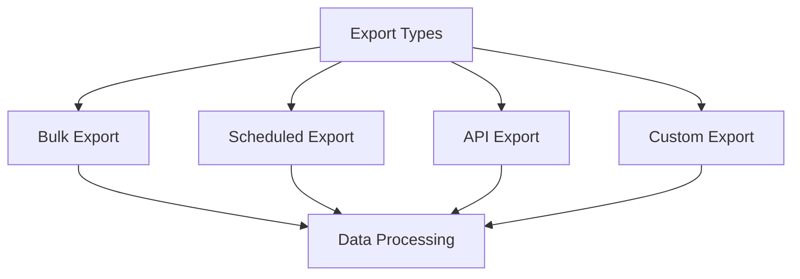

# Advanced Export Features

Master advanced data export capabilities in KazDATA.

## :material-file-export: Advanced Export Options

### Export Types



### Export Formats

| Format | Features | Use Case |
|--------|----------|----------|
| Excel Advanced | Formulas, Macros | Analysis |
| CSV Custom | Delimiters, Encoding | Integration |
| PDF Template | Styling, Layout | Reports |
| JSON API | Structure, Schema | API |

## :material-database: Bulk Export

### Data Selection

1. Advanced filters
    - Complex queries
    - Multiple conditions
    - Custom logic
    - Field selection

2. Data range
    - Date ranges
    - Value ranges
    - Custom periods
    - Batch sizes

### Processing Options

- Data transformation
- Field mapping
- Calculations
- Aggregations
- Formatting

## :material-clock: Scheduled Exports

### Schedule Types

1. Time-based
    - Daily exports
    - Weekly reports
    - Monthly summaries
    - Custom intervals

2. Event-based
    - Data updates
    - Trigger events
    - System alerts
    - User actions

### Delivery Options

- Email delivery
- FTP upload
- API endpoint
- Cloud storage
- Network share

## :material-api: API Integration

### API Export

```json
{
  "export": {
    "format": "json",
    "fields": ["field1", "field2"],
    "filters": {
      "date": {"gte": "2024-01-01"},
      "status": "active"
    },
    "options": {
      "compress": true,
      "batch_size": 1000
    }
  }
}
```

### API Features

- Batch processing
- Stream data
- Custom formats
- Error handling
- Rate limits

## :material-cog: Custom Export

### Template System

1. Template types
    - Report templates
    - Data templates
    - Layout templates
    - Style templates

2. Template features
    - Custom fields
    - Calculations
    - Formatting
    - Branding

### Custom Processing

- Data transformation
- Field mapping
- Calculations
- Validation
- Enrichment

## :material-chart-box: Export Analytics

### Usage Tracking

Monitor:
- Export volume
- Format usage
- Processing time
- Success rates
- Error patterns

### Performance Metrics

Track:
- Response times
- Data volume
- Resource usage
- Queue length
- System load

## :material-tune: Export Optimization

### Performance Tips

1. Data selection
    - Optimize queries
    - Filter early
    - Batch process
    - Stream large data

2. Resource usage
    - Memory efficient
    - CPU optimization
    - Network usage
    - Storage management

### Best Practices

- Use compression
- Implement batching
- Handle errors
- Monitor progress
- Validate output

## :material-security: Security Features

### Data Protection

1. Access control
    - User permissions
    - Role-based access
    - IP restrictions
    - Time limits

2. Data security
    - Encryption
    - Masking
    - Redaction
    - Audit logs

### Compliance

- Data regulations
- Export limits
- Usage tracking
- Audit trails
- Security protocols

## Next Steps

Continue learning:
1. [Data Integration](integration.md)
2. [API Usage](api.md)
3. [Best Practices](../../data/best-practices.md)

## Additional Resources

- [Export Guide](../getting-started/export.md)
- [API Documentation](../../api/index.md)
- [Best Practices](../../data/best-practices.md)

!!! tip "Large Exports"
    Use batch processing and compression for large data exports to optimize performance.
