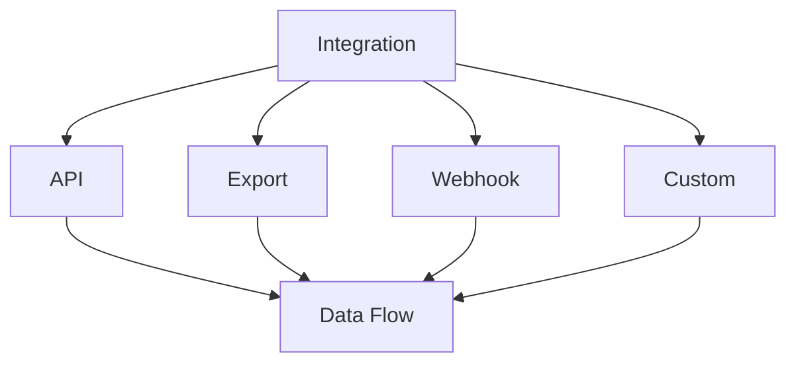
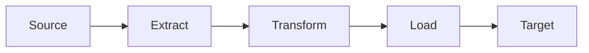

# Data Integration

Learn how to integrate KazDATA data with external systems.

## :material-connection: Integration Types

### Integration Methods



### Available Options

| Method | Use Case | Features |
|--------|----------|----------|
| API | Real-time | Direct access |
| Export | Batch | Large volumes |
| Webhook | Events | Notifications |
| Custom | Special | Tailored solution |

## :material-api: API Integration

### REST API

1. Authentication
    - API keys
    - OAuth tokens
    - JWT tokens
    - Session management

2. Endpoints
    - Organizations
    - Trade data
    - Production
    - Procurement

### GraphQL API

1. Queries
```graphql
query {
  organizations(filter: {
    region: "Almaty"
  }) {
    id
    name
    contacts
  }
}
```

2. Features
    - Field selection
    - Nested queries
    - Mutations
    - Subscriptions

## :material-file-export: Export Integration

### File Formats

1. Structured data
    - CSV
    - Excel
    - JSON
    - XML

2. Special formats
    - Custom delimiters
    - Encoding options
    - Headers
    - Metadata

### Export Methods

- Manual export
- Scheduled export
- API-driven export
- Automated workflow

## :material-webhook: Webhook Integration

### Event Types

1. Data events
    - Created
    - Updated
    - Deleted
    - Status changed

2. System events
    - Export completed
    - Import finished
    - Process status
    - Error notifications

### Implementation

```python
from flask import Flask, request

app = Flask(__name__)

@app.route('/webhook', methods=['POST'])
def handle_webhook():
    event = request.json
    if event['type'] == 'organization.updated':
        process_organization_update(event['data'])
    return {'status': 'success'}
```

## :material-database-sync: Data Synchronization

### Sync Methods

1. Full sync
    - Complete dataset
    - Initial load
    - Data refresh
    - Verification

2. Incremental sync
    - Changed records
    - Delta updates
    - Real-time sync
    - Event-based

### Sync Process



## :material-cog: Configuration

### System Settings

1. Connection
    - Endpoints
    - Credentials
    - Timeouts
    - Retry logic

2. Processing
    - Batch size
    - Queue settings
    - Error handling
    - Logging

### Data Mapping

1. Field mapping
```json
{
  "source_field": "destination_field",
  "transformations": {
    "type": "string",
    "format": "uppercase"
  }
}
```

2. Value mapping
```json
{
  "status_mapping": {
    "A": "Active",
    "I": "Inactive",
    "P": "Pending"
  }
}
```

## :material-chart-timeline: Monitoring

### Metrics

Track:
- Success rate
- Error rate
- Processing time
- Data volume
- System health

### Alerts

Configure for:
- Failed jobs
- Error thresholds
- Performance issues
- System status
- Data quality

## :material-security: Security

### Data Protection

1. Transport security
    - TLS/SSL
    - Encryption
    - VPN
    - IP filtering

2. Access control
    - Authentication
    - Authorization
    - Rate limiting
    - Audit logging

### Compliance

- Data regulations
- Security standards
- Access policies
- Audit requirements
- Documentation

## Next Steps

Continue learning:
1. [API Integration](api.md)
2. [Data Export](export.md)
3. [Best Practices](../../data/best-practices.md)

## Additional Resources

- [API Documentation](../../api/index.md)
- [Export Guide](../getting-started/export.md)
- [Support](../../support/contact.md)

!!! tip "Integration Testing"
    Always test integrations in a development environment first.
