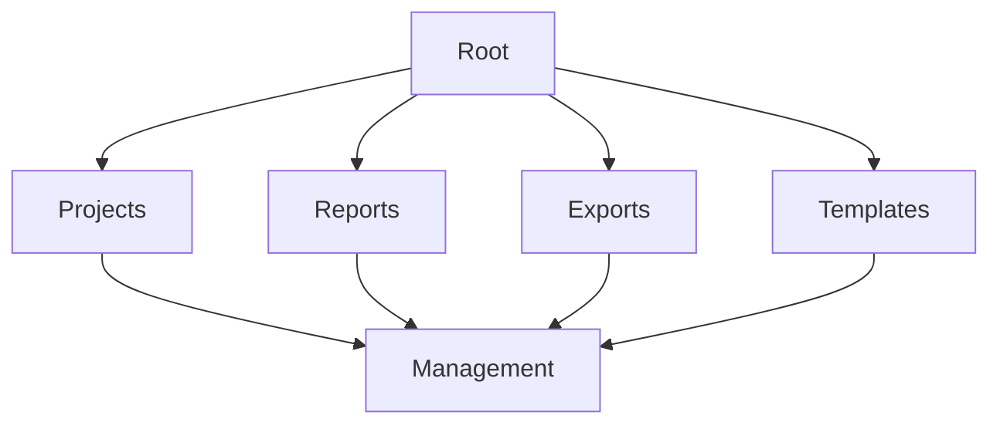

# Data Organization

Learn advanced data organization techniques in KazDATA.

## :material-folder-multiple: Organization Structure

### Folder Hierarchy



### Organization Types

| Type | Description | Use Case |
|------|-------------|----------|
| Projects | Work units | Research |
| Reports | Analysis | Documentation |
| Exports | Data files | Sharing |
| Templates | Reusable | Consistency |

## :material-folder: Project Structure

### Project Components

1. Project folders
    - Data sources
    - Analysis
    - Reports
    - Documentation
    - Resources

2. Project metadata
    - Description
    - Timeline
    - Team members
    - Status
    - Tags

### Implementation

```yaml
project_structure:
  name: "Market Research 2024"
  folders:
    - data:
        - raw
        - processed
        - final
    - analysis:
        - scripts
        - results
        - models
    - reports:
        - drafts
        - final
    - docs:
        - specs
        - notes
        - references
```

## :material-tag-multiple: Tagging System

### Tag Categories

1. Content tags
    - Project type
    - Data source
    - Industry
    - Region
    - Time period

2. Status tags
    - In progress
    - Completed
    - Archived
    - Priority
    - Review

### Tag Management

```python
def manage_tags(item, tags):
    tag_manager = TagManager()
    tag_manager.apply_tags({
        'item': item,
        'tags': tags,
        'metadata': {
            'created': datetime.now(),
            'user': current_user
        }
    })
```

## :material-share: Sharing & Collaboration

### Access Levels

1. User roles
    - Owner
    - Editor
    - Viewer
    - Commenter
    - Guest

2. Permissions
    - View
    - Edit
    - Share
    - Delete
    - Manage

### Sharing Settings

```python
def share_project(project, users):
    sharing = SharingManager()
    sharing.set_permissions({
        'project': project,
        'users': users,
        'settings': {
            'role': 'editor',
            'notify': True,
            'expiry': '30d'
        }
    })
```

## :material-sync: Synchronization

### Sync Types

1. Auto-sync
    - Real-time
    - Scheduled
    - On-change
    - Manual
    - Batch

2. Sync scope
    - Full sync
    - Incremental
    - Selected items
    - Dependencies

### Implementation

```python
def configure_sync(items, options):
    sync_manager = SyncManager()
    sync_manager.setup({
        'items': items,
        'mode': 'auto',
        'schedule': '15m',
        'scope': 'incremental',
        'conflict_resolution': 'newest_wins'
    })
```

## :material-archive: Archiving

### Archive Strategy

1. Archive criteria
    - Age
    - Status
    - Usage
    - Size
    - Priority

2. Archive process
    - Selection
    - Compression
    - Storage
    - Indexing
    - Recovery

### Implementation

```python
def archive_items(items, criteria):
    archiver = ArchiveManager()
    archiver.process({
        'items': items,
        'criteria': criteria,
        'compression': 'high',
        'retention': '1y',
        'index': True
    })
```

## :material-magnify: Search & Discovery

### Search Features

1. Search types
    - Full text
    - Metadata
    - Tags
    - Content
    - Relations

2. Search options
    - Filters
    - Sort
    - Group
    - Export
    - Save

### Implementation

```python
def search_content(query, options):
    searcher = SearchManager()
    return searcher.search({
        'query': query,
        'filters': options.filters,
        'sort': options.sort,
        'scope': ['projects', 'reports', 'data'],
        'include_archived': False
    })
```

## Next Steps

Continue learning:
1. [Data Export](export.md)
2. [Report Generation](reports.md)
3. [Best Practices](../../data/best-practices.md)

## Additional Resources

- [Working with Data](../../data/working.md)
- [File Formats](../../data/formats.md)
- [API Documentation](../../api/index.md)

!!! tip "Organization Strategy"
    Develop a consistent organization strategy and stick to it across all projects.
