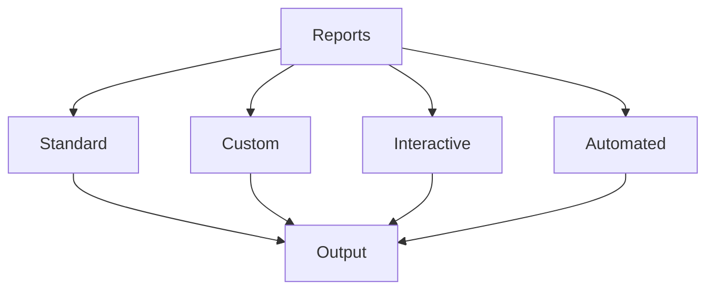

# Report Generation

Learn advanced report generation techniques in KazDATA.

## :material-file-document: Report Types

### Report Categories



### Available Formats

| Format | Use Case | Features |
|--------|----------|----------|
| PDF | Formal reports | Professional layout |
| Excel | Data analysis | Calculations |
| HTML | Web viewing | Interactive |
| Word | Documentation | Rich text |
| PowerPoint | Presentations | Visual focus |

## :material-file-cog: Report Configuration

### Template System

1. Template types
    - Standard templates
    - Custom templates
    - Dynamic templates
    - Interactive templates

2. Template elements
    - Headers/footers
    - Sections
    - Tables
    - Charts
    - Dynamic content

### Layout Options

```yaml
report_layout:
  header:
    title: true
    logo: true
    date: true
  body:
    sections:
      - title: "Executive Summary"
        type: "text"
      - title: "Data Analysis"
        type: "charts"
      - title: "Detailed Results"
        type: "tables"
  footer:
    page_numbers: true
    contact_info: true
```

## :material-chart-box: Data Visualization

### Chart Types

1. Static charts
    - Line charts
    - Bar charts
    - Pie charts
    - Scatter plots
    - Heat maps

2. Interactive charts
    - Drill-down
    - Filters
    - Tooltips
    - Zoom
    - Pan

### Implementation

```python
def create_chart(data, chart_type):
    chart = Chart(chart_type)
    chart.add_data(data)
    chart.set_options({
        'title': 'Data Analysis',
        'interactive': True,
        'responsive': True
    })
    return chart
```

## :material-table: Data Tables

### Table Types

1. Static tables
    - Basic tables
    - Formatted tables
    - Summary tables
    - Cross tables

2. Dynamic tables
    - Sortable
    - Filterable
    - Expandable
    - Searchable

### Formatting

```python
def format_table(data, options):
    table = Table(data)
    table.apply_formatting({
        'header_style': 'bold',
        'alternating_rows': True,
        'number_format': '#,##0.00',
        'date_format': 'YYYY-MM-DD'
    })
    return table
```

## :material-cog: Automation

### Scheduled Reports

1. Time-based
    - Daily reports
    - Weekly summaries
    - Monthly analysis
    - Quarterly reviews
    - Annual reports

2. Event-based
    - Data updates
    - Threshold alerts
    - Status changes
    - User actions

### Implementation

```python
def schedule_report(report_config):
    scheduler = ReportScheduler()
    scheduler.add_job({
        'report': report_config,
        'schedule': 'daily',
        'time': '08:00',
        'timezone': 'UTC',
        'format': 'pdf',
        'delivery': ['email', 'storage']
    })
```

## :material-share: Distribution

### Delivery Methods

1. Email delivery
```python
def email_report(report, recipients):
    mailer = ReportMailer()
    mailer.send({
        'report': report,
        'to': recipients,
        'subject': 'Daily Report',
        'body': 'Please find attached the daily report.'
    })
```

2. Storage options
```python
def store_report(report, location):
    storage = ReportStorage()
    storage.save({
        'report': report,
        'path': location,
        'format': 'pdf',
        'metadata': {
            'date': datetime.now(),
            'version': '1.0'
        }
    })
```

## :material-cog-refresh: Dynamic Content

### Data Sources

1. Live data
    - API connections
    - Database queries
    - Real-time metrics
    - Stream processing

2. Cached data
    - Periodic updates
    - Snapshot data
    - Historical records
    - Aggregated results

### Implementation

```python
def fetch_data(source_config):
    data_source = DataSource(source_config)
    return data_source.fetch({
        'type': 'live',
        'refresh': '5m',
        'cache': True,
        'transform': True
    })
```

## :material-security: Security

### Access Control

1. Permission levels
    - View only
    - Download
    - Edit
    - Share
    - Admin

2. Security features
    - Encryption
    - Watermarks
    - Access logs
    - Version control

## Next Steps

Continue learning:
1. [Data Visualization](visualization.md)
2. [Statistical Analysis](statistics.md)
3. [Best Practices](../../data/best-practices.md)

## Additional Resources

- [Export Guide](../getting-started/export.md)
- [Data Formats](../../data/formats.md)
- [API Documentation](../../api/index.md)

!!! tip "Report Templates"
    Use templates to maintain consistent reporting across your organization.
