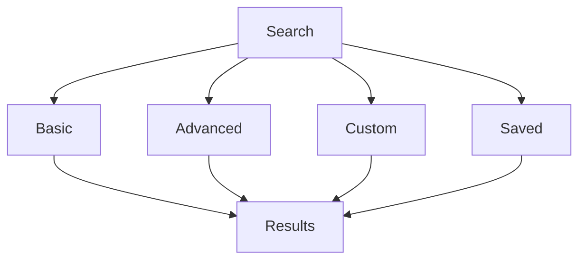

# Advanced Search

Learn advanced search techniques in KazDATA.

## :material-magnify-plus: Advanced Search Features

### Search Types



### Search Components

| Component | Description | Example |
|-----------|-------------|---------|
| Query | Search terms | "Tech Solutions" |
| Filters | Criteria | region:Almaty |
| Sort | Order | name:asc |
| Fields | Selection | name,contacts |
| Format | Output | json,csv |

## :material-filter-plus: Advanced Filters

### Filter Types

1. Text filters
    - Exact match
    - Contains
    - Starts with
    - Ends with
    - Regular expressions

2. Numeric filters
    - Equal to
    - Greater than
    - Less than
    - Between
    - Not equal

### Filter Syntax

```sql
field:value
field:[min TO max]
field:{value1 TO value2}
field:>value
field:<value
```

## :material-code-brackets: Query Language

### Query Components

1. Boolean operators
    - AND
    - OR
    - NOT
    - ()
    - ""

2. Special characters
    - Wildcards (*)
    - Single char (?)
    - Escape (\)
    - Range (..)
    - Boost (^)

### Query Examples

```sql
# Company search
name:"Tech Solutions" AND region:Almaty

# Trade data
product:8517* AND value:[1000 TO 5000]

# Production
industry:Manufacturing AND year:2024
```

## :material-format-list-group: Result Management

### Result Views

1. List view
    - Basic details
    - Quick actions
    - Preview data

2. Table view
    - All fields
    - Custom columns
    - Bulk actions

3. Custom view
    - Selected fields
    - Layout options
    - Formatting

### Result Actions

- Export data
- Save search
- Share results
- Create report
- Analyze data

## :material-content-save: Saved Searches

### Save Options

1. Basic save
    - Query
    - Filters
    - Sort order
    - View type

2. Advanced save
    - Schedule
    - Notifications
    - Share settings
    - Export format

### Implementation

```python
def save_search(search_config):
    saved_search = {
        'query': search_config.query,
        'filters': search_config.filters,
        'sort': search_config.sort,
        'schedule': {
            'frequency': 'daily',
            'format': 'csv',
            'delivery': 'email'
        }
    }
    return save_to_database(saved_search)
```

## :material-share: Search Sharing

### Share Options

1. Share types
    - Link sharing
    - User sharing
    - Group sharing
    - Public sharing

2. Permission levels
    - View only
    - Execute
    - Edit
    - Manage
    - Admin

### Implementation

```python
def share_search(search_id, share_config):
    sharing = {
        'search_id': search_id,
        'type': share_config.type,
        'recipients': share_config.recipients,
        'permissions': share_config.permissions,
        'expiry': share_config.expiry
    }
    return update_sharing(sharing)
```

## :material-chart-box: Search Analytics

### Usage Metrics

Track:
- Popular searches
- Failed searches
- Result counts
- Response times
- User patterns

### Performance

Monitor:
- Query speed
- Result size
- Cache hits
- Error rates
- System load

## Next Steps

Continue learning:
1. [Basic Search](../getting-started/search.md)
2. [Data Export](export.md)
3. [Best Practices](../../data/best-practices.md)

## Additional Resources

- [API Documentation](../../api/index.md)
- [Working with Data](../../data/working.md)
- [Support](../../support/contact.md)

!!! tip "Search Performance"
    Use specific filters and field selection to optimize search performance.
