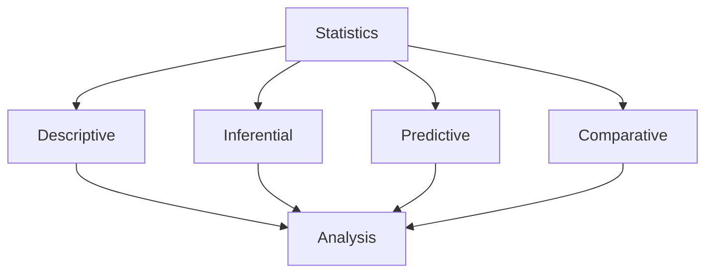

# Statistical Analysis

Learn advanced statistical analysis techniques in KazDATA.

## :material-chart-bell-curve: Statistical Methods

### Basic Statistics



### Common Metrics

| Metric | Description | Use Case |
|--------|-------------|----------|
| Mean | Average value | Central tendency |
| Median | Middle value | Distribution |
| Mode | Most frequent | Patterns |
| Variance | Spread | Dispersion |
| Correlation | Relationship | Dependencies |

## :material-calculator: Descriptive Statistics

### Central Tendency

1. Mean calculation
```python
def calculate_mean(values):
    return sum(values) / len(values)
```

2. Median finding
```python
def calculate_median(values):
    sorted_values = sorted(values)
    n = len(sorted_values)
    mid = n // 2
    return sorted_values[mid] if n % 2 else (sorted_values[mid-1] + sorted_values[mid]) / 2
```

### Dispersion Measures

1. Variance
```python
def calculate_variance(values):
    mean = calculate_mean(values)
    squared_diff = [(x - mean) ** 2 for x in values]
    return sum(squared_diff) / len(values)
```

2. Standard deviation
```python
def calculate_std_dev(values):
    return math.sqrt(calculate_variance(values))
```

## :material-chart-scatter-plot: Correlation Analysis

### Correlation Types

1. Pearson correlation
    - Linear relationship
    - Continuous data
    - Normal distribution
    - -1 to 1 scale

2. Spearman correlation
    - Rank correlation
    - Non-linear
    - Ordinal data
    - Monotonic relationship

### Implementation

```python
def calculate_correlation(x, y):
    n = len(x)
    mean_x = sum(x) / n
    mean_y = sum(y) / n
    
    covariance = sum((x[i] - mean_x) * (y[i] - mean_y) for i in range(n))
    std_x = math.sqrt(sum((val - mean_x) ** 2 for val in x))
    std_y = math.sqrt(sum((val - mean_y) ** 2 for val in y))
    
    return covariance / (std_x * std_y)
```

## :material-chart-timeline: Time Series Analysis

### Time Series Components

1. Trend analysis
    - Long-term direction
    - Secular trend
    - Growth patterns
    - Decline patterns

2. Seasonal patterns
    - Periodic variations
    - Seasonal indices
    - Cyclical patterns
    - Irregular fluctuations

### Analysis Methods

```python
def decompose_time_series(data):
    # Additive decomposition
    trend = calculate_trend(data)
    seasonal = calculate_seasonal(data)
    residual = data - trend - seasonal
    return trend, seasonal, residual
```

## :material-chart-box: Distribution Analysis

### Distribution Types

1. Normal distribution
    - Bell curve
    - Symmetrical
    - Mean = Median
    - Standard deviation

2. Other distributions
    - Skewed
    - Multimodal
    - Heavy-tailed
    - Discrete

### Testing Methods

```python
def test_normality(data):
    # Shapiro-Wilk test
    statistic, p_value = stats.shapiro(data)
    return {
        'statistic': statistic,
        'p_value': p_value,
        'is_normal': p_value > 0.05
    }
```

## :material-test-tube: Hypothesis Testing

### Test Types

1. T-tests
    - One-sample
    - Two-sample
    - Paired

2. ANOVA
    - One-way
    - Two-way
    - Repeated measures

### Implementation

```python
def perform_ttest(group1, group2):
    statistic, p_value = stats.ttest_ind(group1, group2)
    return {
        'statistic': statistic,
        'p_value': p_value,
        'significant': p_value < 0.05
    }
```

## :material-chart-sankey: Regression Analysis

### Regression Types

1. Linear regression
    - Simple
    - Multiple
    - Polynomial
    - Logistic

2. Advanced regression
    - Ridge
    - Lasso
    - Elastic Net
    - Non-linear

### Model Building

```python
def build_linear_model(X, y):
    # Simple linear regression
    slope, intercept = np.polyfit(X, y, 1)
    return {
        'slope': slope,
        'intercept': intercept,
        'equation': f'y = {slope:.2f}x + {intercept:.2f}'
    }
```

## Next Steps

Continue learning:
1. [Data Visualization](visualization.md)
2. [Report Generation](reports.md)
3. [Best Practices](../../data/best-practices.md)

## Additional Resources

- [Analysis Tools](../../analysis/market-size.md)
- [Data Export](../getting-started/export.md)
- [API Documentation](../../api/index.md)

!!! tip "Statistical Significance"
    Always consider statistical significance when interpreting results.
