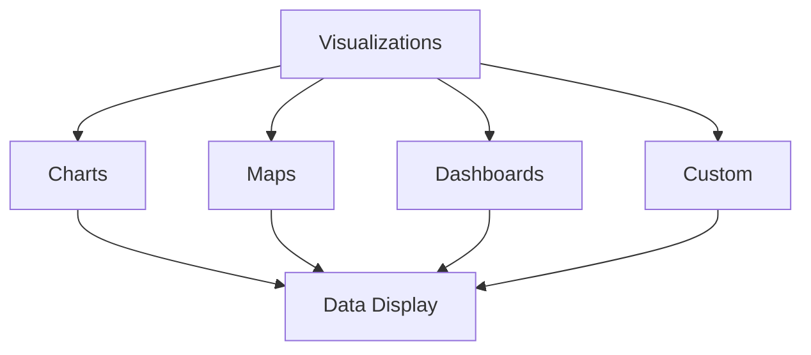

# Advanced Data Visualization

Master advanced data visualization techniques in KazDATA.

## :material-chart-box: Visualization Types

### Chart Categories



### Available Charts

| Type | Use Case | Features |
|------|----------|----------|
| Line Charts | Trends | Time series |
| Bar Charts | Comparison | Categories |
| Pie Charts | Distribution | Proportions |
| Heat Maps | Density | Patterns |
| Scatter Plots | Correlation | Relationships |

## :material-chart-line: Time Series

### Trend Analysis

1. Line charts
    - Single metric
    - Multiple metrics
    - Moving averages
    - Trend lines

2. Area charts
    - Stacked areas
    - Percentage
    - Cumulative
    - Streamgraph

### Time Periods

- Daily data
- Weekly trends
- Monthly patterns
- Yearly comparison
- Custom periods

## :material-chart-bar: Comparison Charts

### Bar Charts

1. Vertical bars
    - Single series
    - Multiple series
    - Stacked bars
    - Grouped bars

2. Horizontal bars
    - Category comparison
    - Ranking
    - Distribution
    - Progress

### Advanced Features

- Error bars
- Baseline markers
- Reference lines
- Annotations
- Tooltips

## :material-map: Geographic Visualization

### Map Types

1. Region maps
    - Country level
    - Region level
    - City level
    - Custom areas

2. Heat maps
    - Density
    - Distribution
    - Concentration
    - Patterns

### Map Features

- Zoom levels
- Interactive tooltips
- Custom regions
- Data layers
- Legends

## :material-view-dashboard: Dashboards

### Layout Options

1. Grid layout
    - Fixed grid
    - Responsive
    - Custom sizing
    - Auto-arrange

2. Component types
    - Charts
    - Tables
    - Maps
    - Metrics
    - Controls

### Interactivity

- Filters
- Drill-down
- Cross-filtering
- Tooltips
- Actions

## :material-palette: Design Elements

### Color Schemes

1. Standard palettes
    - Sequential
    - Diverging
    - Categorical
    - Custom

2. Color usage
    - Emphasis
    - Categories
    - Values
    - Status

### Typography

- Font selection
- Size hierarchy
- Label placement
- Legend format
- Annotations

## :material-tune: Customization

### Chart Options

1. Axes
    - Scale types
    - Labels
    - Gridlines
    - Ticks
    - Range

2. Legend
    - Position
    - Style
    - Interaction
    - Format

### Advanced Features

- Custom tooltips
- Click events
- Animations
- Export options
- Themes

## :material-cog: Configuration

### Settings

1. Global options
    - Theme
    - Colors
    - Fonts
    - Defaults
    - Formats

2. Chart-specific
    - Type options
    - Data mapping
    - Interactions
    - Animations

### Data Binding

- Data sources
- Field mapping
- Calculations
- Aggregations
- Formatting

## :material-code-tags: API Integration

### Chart API

```javascript
const chart = new Chart({
  type: 'line',
  data: {
    labels: ['Jan', 'Feb', 'Mar'],
    datasets: [{
      label: 'Sales',
      data: [10, 20, 30]
    }]
  },
  options: {
    responsive: true
  }
});
```

### Customization API

- Event handlers
- Custom components
- Plugin system
- Theme creation
- Extensions

## Next Steps

Continue learning:
1. [Statistical Analysis](statistics.md)
2. [Report Generation](reports.md)
3. [Best Practices](../../data/best-practices.md)

## Additional Resources

- [Chart Types](../../data/formats.md)
- [Data Export](../getting-started/export.md)
- [API Documentation](../../api/index.md)

!!! tip "Performance"
    Use appropriate chart types and limit data points for better performance.
