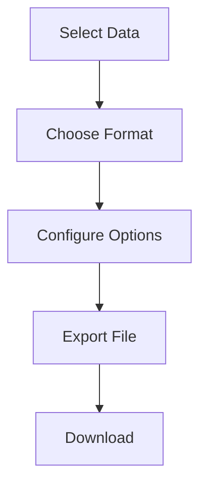

# Data Export Guide

Learn how to export data from KazDATA effectively.

## :material-file-export: Export Basics

### Export Process

### Available Formats

| Format | Use Case | Features |
|--------|----------|----------|
| Excel (.xlsx) | Analysis | Formulas, Pivot tables |
| CSV | Integration | Universal, Simple |
| PDF | Reporting | Professional, Print-ready |
| JSON | API | Machine-readable |

## :material-cog: Export Options

### Data Selection

1. Select records
    - Individual items
    - Multiple items
    - All results
    - Custom selection

2. Choose fields
    - Essential fields
    - Custom fields
    - All fields
    - Calculated fields

### Format Configuration

#### Excel Options

- Sheet names
- Column headers
- Data formatting
- Formula inclusion
- Pivot tables

#### CSV Settings

- Delimiter type
- Encoding
- Header row
- Quote options
- Date format

#### PDF Configuration

- Page layout
- Header/Footer
- Font settings
- Table styling
- Image quality

## :material-filter: Data Filtering

### Pre-Export Filters

1. Date range
2. Categories
3. Values
4. Status
5. Location

### Data Transformation

- Sort order
- Grouping
- Aggregation
- Calculations
- Formatting

## :material-chart-box: Export Templates

### Template Types

1. Standard templates
    - Basic export
    - Full details
    - Summary view
    - Custom layout

2. Custom templates
    - Saved layouts
    - Field selection
    - Format settings
    - Filter configs

### Template Management

- Create template
- Save settings
- Share template
- Update existing
- Delete unused

## :material-clock: Scheduled Exports

### Schedule Options

1. Frequency
    - Daily
    - Weekly
    - Monthly
    - Custom

2. Delivery
    - Email
    - FTP
    - API
    - Cloud storage

### Automation Settings

- Data selection
- Format choice
- Filter criteria
- Delivery method
- Notification preferences

## :material-database: Large Exports

### Handling Big Data

1. Batch processing
    - Split large exports
    - Queue management
    - Progress tracking
    - Resume capability

2. Optimization
    - Field selection
    - Data compression
    - Format choice
    - Server load

### Best Practices

- Schedule off-peak
- Use compression
- Split large files
- Monitor progress
- Verify completion

## :material-security: Export Security

### Data Protection

1. Access control
    - User permissions
    - Data restrictions
    - Format limitations
    - Volume limits

2. Security measures
    - Encryption
    - Password protection
    - Access logging
    - IP restrictions

### Compliance

- Data regulations
- Export limits
- Usage tracking
- Audit logs
- Security protocols

## :material-chart-timeline: Export Analytics

### Usage Statistics

View your:
- Export volume
- Popular formats
- Common filters
- Peak times
- Success rates

### Performance Metrics

Track:
- Export speed
- File sizes
- Success rates
- Error patterns
- System load

## :material-alert: Troubleshooting

### Common Issues

1. Export fails
    - Check size
    - Verify format
    - Review filters
    - Check permissions
    
2. Slow exports
    - Reduce data
    - Optimize filters
    - Change format
    - Schedule off-peak

## Next Steps

Continue learning:
1. [Save & Organize](saving.md)
2. [Advanced Features](../advanced/export.md)
3. [Best Practices](../../data/best-practices.md)

## Additional Resources

- [Data Formats](../../data/formats.md)
- [Working with Data](../../data/working.md)
- [FAQ](../../getting-started/faq.md)
- [Support](../../support/contact.md)

!!! tip "Export Limits"
    Check your subscription plan for export volume limits and available formats.
