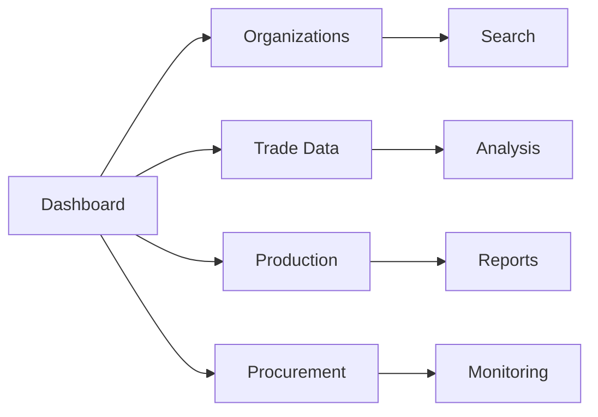

# First Steps with KazDATA

Learn how to start using KazDATA effectively.

## :material-login: Logging In

### Access the Platform

1. Visit [KazDATA Platform](https://kazdata.kz)
2. Click "Login" button
3. Enter credentials:
    - Email address
    - Password
4. Click "Sign In"

### Verify Account Status

Check your:
- Subscription status
- Access level
- Available features
- Usage limits

## :material-view-dashboard: Dashboard Overview

### Main Sections

### Key Elements

1. Navigation menu
2. Search bar
3. Quick filters
4. Recent searches
5. Saved items

## :material-magnify: Basic Search

### Company Search

1. Select Organizations module
2. Enter search criteria:
    - Company name
    - BIN number
    - Location
    - Industry
3. Apply filters
4. View results

### Trade Data Search

1. Select Trade module
2. Choose data type:
    - Imports
    - Exports
3. Set parameters:
    - Time period
    - Products
    - Countries
4. Generate report

## :material-file-export: Exporting Data

### Export Options

Available formats:
- Excel (.xlsx)
- CSV
- PDF
- Custom formats

### Export Process

1. Select data
2. Choose format
3. Configure options:
    - Fields
    - Filters
    - Sorting
4. Download file

## :material-content-save: Saving Work

### Save Options

- Save searches
- Save filters
- Save reports
- Save views
- Create templates

### Organization

Create folders for:
- Frequent searches
- Regular reports
- Important data
- Project work
- Custom views

## :material-chart-box: Basic Analysis

### Data Views

1. Table view
    - Sort columns
    - Filter rows
    - Group data
    - Custom views

2. Chart view
    - Line charts
    - Bar graphs
    - Pie charts
    - Heat maps

### Quick Analysis

1. Select metrics
2. Choose visualization
3. Apply filters
4. Save view
5. Export results

## :material-cog: Customization

### Interface Settings

Customize:
- Layout
- Theme
- Language
- Display options
- Quick access

### Preferences

Set defaults for:
- Search options
- Export format
- Data display
- Notifications
- Updates

## :material-alert: Common Issues

### Login Problems

1. Check credentials
2. Clear cache
3. Use password reset
4. Contact support

### Data Access

1. Verify subscription
2. Check permissions
3. Review limits
4. Update plan

## :material-lightbulb: Best Practices

### Efficient Search

1. Use specific terms
2. Apply filters
3. Save searches
4. Create templates
5. Export needed data

### Data Management

1. Organize projects
2. Save important views
3. Export regularly
4. Update saved items
5. Clean old data

## Next Steps

Continue learning:
1. [Advanced Search](search.md)
2. [Data Export Guide](export.md)
3. [Save & Organize](saving.md)

## Additional Resources

- [Platform Overview](../../getting-started/platform-overview.md)
- [Interface Guide](../../getting-started/interface.md)
- [FAQ](../../getting-started/faq.md)
- [Support](../../support/contact.md)

!!! tip "Need Help?"
    Our [support team](../../support/contact.md) is available to assist you with any questions.
