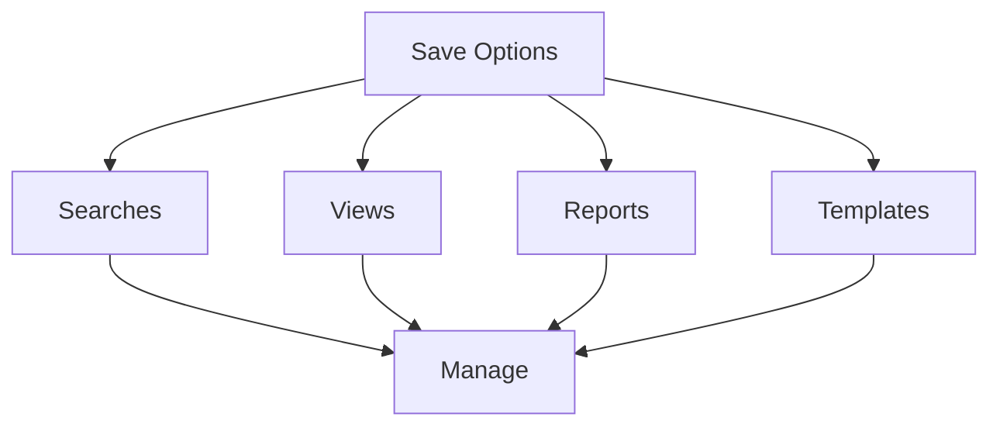

# Save & Organize

Learn how to save and organize your work in KazDATA.

## :material-content-save: Saving Basics

### Save Options

### What to Save

| Type | Description | Use Case |
|------|-------------|----------|
| Searches | Search criteria | Regular lookups |
| Views | Data layouts | Custom displays |
| Reports | Generated reports | Analysis sharing |
| Templates | Reusable formats | Consistent output |

## :material-folder: Organization

### Folder Structure

1. Root folders
    - Searches
    - Views
    - Reports
    - Templates
    - Exports

2. Custom folders
    - Projects
    - Clients
    - Categories
    - Time periods

### Naming Conventions

Best practices:
- Clear names
- Date prefixes
- Category tags
- Version numbers
- Status indicators

## :material-bookmark: Saved Searches

### Search Components

Save complete search:
- Search terms
- Filters
- Sort order
- View settings
- Export format

### Search Management

1. Create folders
2. Group searches
3. Add descriptions
4. Set categories
5. Update regularly

## :material-view-grid: Custom Views

### View Settings

Customize:
- Column selection
- Column order
- Sort preferences
- Filter settings
- Display options

### View Types

1. List views
    - Basic details
    - Quick overview
    - Essential fields
    
2. Detail views
    - Full information
    - All fields
    - Related data

3. Custom views
    - Selected fields
    - Specific layout
    - Special formatting

## :material-file-document: Reports

### Report Types

1. Standard reports
    - Basic data
    - Common formats
    - Regular updates

2. Custom reports
    - Specific data
    - Special layout
    - Unique metrics

### Report Organization

- Create categories
- Set schedules
- Define formats
- Manage versions
- Track changes

## :material-format-list-checks: Templates

### Template Types

1. Export templates
    - Field selection
    - Format settings
    - Layout options
    
2. Report templates
    - Report structure
    - Data placement
    - Styling options

### Template Management

- Create standards
- Share templates
- Update versions
- Track usage
- Archive old

## :material-share: Sharing

### Share Options

1. Internal sharing
    - Team members
    - Departments
    - Projects
    - Groups

2. External sharing
    - Clients
    - Partners
    - Stakeholders
    - Public

### Access Control

- Set permissions
- Track usage
- Manage versions
- Control edits
- Monitor sharing

## :material-sync: Synchronization

### Auto-Save

Features:
- Work progress
- Search history
- Recent views
- Draft reports
- Temporary files

### Cloud Backup

Options:
- Auto backup
- Version control
- Sync settings
- Recovery options
- Archive access

## :material-tag: Tagging

### Tag Types

1. Category tags
    - Project
    - Client
    - Department
    - Priority

2. Status tags
    - Active
    - Archive
    - Draft
    - Final

### Tag Management

- Create hierarchy
- Set standards
- Update tags
- Remove unused
- Track usage

## :material-archive: Archiving

### Archive Process

1. Select items
2. Set archive date
3. Add description
4. Choose location
5. Maintain index

### Archive Management

- Regular cleanup
- Version control
- Access logs
- Recovery process
- Storage limits

## Next Steps

Continue learning:
1. [Advanced Features](../advanced/organization.md)
2. [Best Practices](../../data/best-practices.md)
3. [Data Management](../../data/working.md)

## Additional Resources

- [Working with Data](../../data/working.md)
- [Best Practices](../../data/best-practices.md)
- [FAQ](../../getting-started/faq.md)
- [Support](../../support/contact.md)

!!! tip "Storage Limits"
    Check your subscription plan for storage limits and retention policies.
