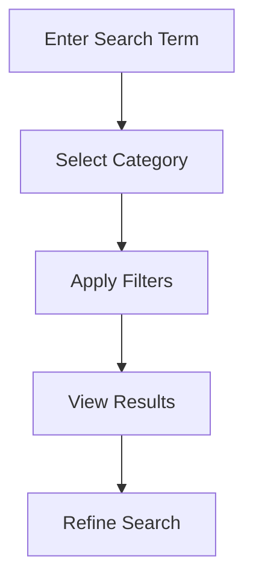

# Search Guide

Learn effective search techniques for finding data in KazDATA.

## :material-magnify: Basic Search

### Search Bar Usage



### Quick Search Tips

1. Use specific terms
2. Try different variations
3. Use wildcards (*) 
4. Combine keywords
5. Check spelling

## :material-filter: Advanced Filters

### Company Filters

| Filter | Description | Example |
|--------|-------------|---------|
| Name | Company name | "Tech Solutions" |
| BIN | Business ID | "123456789012" |
| Location | City/Region | "Almaty" |
| Industry | OKED code | "62.01.1" |

### Trade Filters

| Filter | Description | Example |
|--------|-------------|---------|
| Product | HS code/name | "8517.12.00" |
| Country | Origin/Destination | "China" |
| Period | Date range | "2023-Q4" |
| Value | Amount range | "> 1,000,000" |

## :material-text-box-search: Search Operators

### Boolean Operators

- AND: Both terms
- OR: Either term
- NOT: Exclude term
- " ": Exact phrase
- ( ): Group terms

### Examples

```sql
"Tech Solutions" AND Almaty
Software OR IT
Manufacturing NOT Construction
(Import OR Export) AND "2023"
```

## :material-format-list-bulleted: Search Results

### Results View

1. List view
    - Basic details
    - Quick actions
    - Preview data

2. Table view
    - Sortable columns
    - Bulk actions
    - Custom views

3. Card view
    - Visual layout
    - Key metrics
    - Quick access

### Result Actions

- View details
- Export data
- Save search
- Share results
- Create report

## :material-content-save: Saving Searches

### Save Options

1. Quick save
    - Current search
    - All filters
    - Sort order

2. Custom save
    - Named search
    - Description
    - Categories
    - Notifications

### Managing Saved Searches

1. Access saved searches
2. Edit parameters
3. Update filters
4. Delete outdated
5. Share with team

## :material-chart-box: Search Analytics

### Usage Statistics

View your:
- Recent searches
- Popular terms
- Success rates
- Export history
- Time savings

### Search Patterns

Analyze:
- Common terms
- Filter usage
- Result clicks
- Export types
- Search flow

## :material-tune: Search Optimization

### Improving Results

1. Use specific terms
2. Apply relevant filters
3. Check categories
4. Verify dates
5. Combine filters

### Common Issues

1. Too many results
    - Add filters
    - Use specific terms
    - Narrow date range
    
2. No results
    - Check spelling
    - Try synonyms
    - Broaden search
    - Remove filters

## :material-school: Best Practices

### Search Strategy

1. Plan your search
2. Start broad
3. Refine gradually
4. Save useful searches
5. Document process

### Efficient Workflow

1. Use templates
2. Create shortcuts
3. Save filters
4. Export regularly
5. Share results

## Next Steps

Continue learning:
1. [Data Export](export.md)
2. [Save & Organize](saving.md)
3. [Advanced Features](../advanced/search.md)

## Additional Resources

- [Interface Guide](../../getting-started/interface.md)
- [FAQ](../../getting-started/faq.md)
- [Support](../../support/contact.md)

!!! tip "Search Help"
    Use the search box in the top navigation to quickly find documentation topics.
